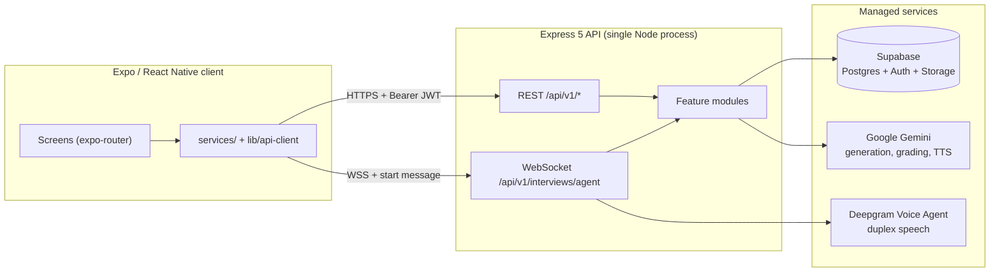

<!--
  This file follows the Standard Readme specification.
  https://github.com/RichardLitt/standard-readme
-->

# VoxPrep

> AI-powered interview and examination practice for mobile — spoken mock interviews with a multi-voice panel, and generated written exam papers, both built from material the user supplies.

[](https://nodejs.org)
[](https://expo.dev)
[](docs/api/openapi.yaml)
[](https://www.conventionalcommits.org/en/v1.0.0/)
[](CHANGELOG.md)

VoxPrep turns a job description, a thesis abstract, a visa application, or a set
of course notes into practice. Upload or paste the material and the platform
either runs a **live spoken interview** — a panel of distinct AI voices that
listen, ask, follow up, and grade — or sets a **written multiple-choice exam**
of thirty questions marked out of 100. Afterwards it returns per-answer
feedback, a session score, a reviewable history, and — because the job
description is already on file — an optional CV rewritten against that job.

The system is two deployables: an **Express 5 REST + WebSocket API** backed by
Supabase (PostgreSQL, Auth, Storage), and an **Expo / React Native** client for
iOS, Android, and web.

## Table of Contents

- [Background](#background)
- [Features](#features)
- [Architecture at a glance](#architecture-at-a-glance)
- [Install](#install)
- [Usage](#usage)
- [Documentation](#documentation)
- [API](#api)
- [Repository layout](#repository-layout)
- [Testing](#testing)
- [Maintainers](#maintainers)
- [Contributing](#contributing)
- [Security](#security)
- [License](#license)

## Background

Interview practice tools generally fall into two camps: static question banks
that never react to what you say, and video-call role-play that needs another
human on the other end. Neither rehearses the thing that actually goes wrong in
a real interview — being asked a follow-up you did not plan for, by a person
whose voice you have not heard before, about a claim you made ninety seconds
ago.

VoxPrep is built around that gap. Questions are written one turn at a time
against what the candidate has already said, not generated up front from a
template. A panel is seated with genuinely distinct synthesised voices, so a
three-person board sounds like three people. And the same source material can
be turned into a written paper instead, for the cases — coursework, a viva's
underlying syllabus — where recall is what needs testing rather than delivery.

## Features

| Capability | Summary |
| --- | --- |
| **Live voice interview** | Full-duplex WebSocket session. Microphone audio up, interviewer audio down, streamed as it is generated. See [the protocol reference](docs/voice-agent-protocol.md). |
| **Practice modes** | `job_interview`, `viva_defense`, `visa_interview` (spoken) and `exam` (written). Each has its own persona, question mix, and rules. |
| **AI panel** | Up to four seats, chair first, each with a distinct TTS voice. The server rotates the floor and enforces voice distinctness. |
| **Written exams** | 30 questions × 4 options, generated from the material, marked arithmetically with per-question explanations. |
| **Document ingestion** | PDF, Word, PowerPoint, Excel, OpenDocument, RTF, Markdown, CSV, and plain text. |
| **Per-answer feedback** | Relevance, completeness, technical accuracy, clarity, and confidence, each 0–100, averaged only over the dimensions the grader actually reported. |
| **History & progress** | Reviewable past sessions, notes, archiving, and aggregate statistics. |
| **CV tailoring** | Rewrites an uploaded CV against the session's job description, reporting what changed, which keywords now have evidence, and which gaps remain. |
| **Auth** | Supabase Auth with email/password, Google OAuth, email verification, OTP password reset, and transparent access-token refresh on the client. |

## Architecture at a glance



The REST API and the voice gateway share **one HTTP server and one port**. That
is deliberate: one port is one firewall rule, one tunnel, and one URL for the
client to derive. Full reasoning, module boundaries, and request lifecycles are
in [`docs/architecture.md`](docs/architecture.md).

## Install

### Prerequisites

| Requirement | Version | Notes |
| --- | --- | --- |
| Node.js | ≥ 20.x LTS | Both workspaces. ES modules throughout (`"type": "module"`). |
| npm | ≥ 10.x | Ships with Node 20. |
| Supabase project | — | Provides PostgreSQL, Auth, and Storage. |
| Google Gemini API key | — | Question generation, grading, CV tailoring, TTS. |
| Deepgram API key | — | Live voice interviews. Without it the API still runs; the voice gateway refuses upgrades. |
| Expo Go **or** a dev build | SDK 54 | A dev build is required for live voice — see [`docs/frontend.md`](docs/frontend.md). |

### Clone and install

```bash
git clone <repository-url> VoxPrep
cd VoxPrep

npm install                    # root dev tooling
npm install --prefix backend   # API dependencies
npm install --prefix frontend  # client dependencies
```

### Configure

Create `backend/.env` and `frontend/.env.local`. Every variable, its default,
and whether it is required is listed in
[`docs/configuration.md`](docs/configuration.md). The minimum viable set:

```dotenv
# backend/.env
PORT=5050
NODE_ENV=development
SUPABASE_URL=https://<project-ref>.supabase.co
SUPABASE_PUBLISHABLE_KEY=sb_publishable_...
SUPABASE_SECRET_KEY=sb_secret_...
GEMINI_API_KEY=...
DEEPGRAM_API_KEY=...
FRONTEND_URL=http://localhost:8081
```

```dotenv
# frontend/.env.local
EXPO_PUBLIC_API_URL=http://<your-lan-ip>:5050/api/v1
```

> **Note** — In development the client derives the API host from the Expo dev
> server it is already connected to, so `EXPO_PUBLIC_API_URL` going stale after
> a DHCP lease change does not break the app. The port and path are still read
> from it.

### Apply the database schema

For a **new** Supabase project, run `backend/supabase_schema.sql` in the SQL
editor. For an **existing** database, apply only the dated files in
`backend/migrations/` — the full schema file is not idempotent and must not be
re-run over live data.

## Usage

```bash
npm run backend    # API on http://localhost:5050  (nodemon)
npm run frontend   # Expo dev server on :8081
```

Verify the API is up:

```bash
curl http://localhost:5050/health
# {"success":true,"message":"Server is healthy","timestamp":"2026-08-28T…Z"}
```

A complete first run — sign up, prepare a session, hold an interview, read the
feedback — is walked through in
[`docs/getting-started.md`](docs/getting-started.md).

## Documentation

Documentation is organised along the [Diátaxis](https://diataxis.fr/)
framework: tutorials teach, how-to guides solve, reference describes,
explanation justifies.

| Document | Kind | Contents |
| --- | --- | --- |
| [`docs/getting-started.md`](docs/getting-started.md) | Tutorial | End-to-end first run, both workspaces. |
| [`docs/architecture.md`](docs/architecture.md) | Explanation | System context, containers, modules, request lifecycles. |
| [`docs/api/README.md`](docs/api/README.md) | Reference | Conventions, auth, envelopes, errors, rate limits, pagination. |
| [`docs/api/openapi.yaml`](docs/api/openapi.yaml) | Reference | Machine-readable OpenAPI 3.1 description of every REST endpoint. |
| [`docs/voice-agent-protocol.md`](docs/voice-agent-protocol.md) | Reference | WebSocket handshake, frame types, close codes, audio formats. |
| [`docs/data-model.md`](docs/data-model.md) | Reference | Tables, relationships, RLS policies, triggers, views, migrations. |
| [`docs/configuration.md`](docs/configuration.md) | Reference | Every environment variable in both workspaces. |
| [`docs/frontend.md`](docs/frontend.md) | Reference | Screen map, navigation, state, services, native requirements. |
| [`docs/testing.md`](docs/testing.md) | How-to | Running, writing, and structuring tests. |
| [`docs/deployment.md`](docs/deployment.md) | How-to | Production checklist, build and release for API and app. |
| [`docs/adr/`](docs/adr/) | Explanation | Architecture Decision Records — why the system is shaped this way. |
| [`docs/glossary.md`](docs/glossary.md) | Reference | Domain vocabulary. |

## API

All REST endpoints are versioned under `/api/v1` and — apart from
authentication and `/health` — require a Supabase access token:

```http
Authorization: Bearer <access_token>
```

Every response uses one envelope:

```jsonc
// success
{ "status": "success", "message": "…", "data": { /* endpoint-specific */ } }

// failure
{ "status": "error", "message": "human-readable reason" }
```

| Prefix | Module |
| --- | --- |
| `/api/v1/auth` | Sign-up, sign-in, refresh, OAuth, verification, password reset |
| `/api/v1/users` | Own profile, status, account deletion |
| `/api/v1/job-descriptions` | Source material CRUD |
| `/api/v1/interviews` | Session lifecycle, one-shot prepare, per-turn interviewing |
| `/api/v1/exams` | Paper generation, sitting, marking, retaking |
| `/api/v1/questions` | Bulk question generation |
| `/api/v1/responses` | Candidate answers and per-session statistics |
| `/api/v1/speech` | Transcription, synthesis, voice and format catalogues |
| `/api/v1/feedback` | Grading and session summaries |
| `/api/v1/history` | Reviewable sessions, notes, archiving, stats |
| `/api/v1/cv` | CV tailoring against a session's job description |

The full contract is in [`docs/api/openapi.yaml`](docs/api/openapi.yaml) and can
be rendered with any OpenAPI 3.1 tool:

```bash
npx @redocly/cli preview-docs docs/api/openapi.yaml
```

## Repository layout

```
VoxPrep/
├── backend/                  Express 5 API + WebSocket voice gateway
│   ├── migrations/           Dated, idempotent SQL for live databases
│   ├── src/
│   │   ├── app.js            Middleware stack, route mounting, error handler
│   │   ├── server.js         Startup, voice gateway attachment, graceful shutdown
│   │   ├── config/           External service clients (Supabase, Gemini, Deepgram, …)
│   │   ├── core/             Errors, middleware, shared utilities, response helpers
│   │   └── modules/          One directory per bounded context
│   └── supabase_schema.sql   Full schema for a fresh project
├── frontend/                 Expo / React Native client
│   ├── app/                  File-based routes (expo-router)
│   ├── components/           Shared presentational components
│   ├── constants/            Modes, interviewer roster, theme, upload rules
│   ├── hooks/                React context providers and custom hooks
│   ├── lib/                  API client, token storage, formatting, PDF export
│   ├── services/             Typed wrappers over each API module
│   └── types/                Shared TypeScript contracts
└── docs/                     This documentation set
```

Each backend module follows the same file convention:

```
<module>.routes.js       HTTP surface and route ordering
<module>.controller.js   Request validation, status codes, error translation
<module>.service.js      Business logic and persistence
<module>.mapper.js       Database rows → wire shapes (the only path outward)
<module>.validation.js   Joi schemas
```

## Testing

```bash
npm test --prefix backend                 # Jest, serial, open-handle detection
npm test --prefix backend -- panel.test   # a single suite
npm run lint --prefix frontend            # ESLint (expo config)
```

Thirty-plus suites live in `backend/src/modules/__test__/`. Conventions,
fixtures, and the reasoning behind `--runInBand` are documented in
[`docs/testing.md`](docs/testing.md).

## Maintainers

See [`CONTRIBUTING.md`](CONTRIBUTING.md#getting-help) for how to reach the
maintainers and what to include when you do.

## Contributing

Pull requests are welcome. Please read [`CONTRIBUTING.md`](CONTRIBUTING.md)
first — it covers the branching model,
[Conventional Commits](https://www.conventionalcommits.org/en/v1.0.0/), the
review checklist, and the documentation standards this repository holds itself
to.

This project adopts the [Contributor Covenant](CODE_OF_CONDUCT.md) v2.1. By
participating you agree to abide by its terms.

## Security

Do **not** open a public issue for a security vulnerability. Follow the
coordinated disclosure process in [`SECURITY.md`](SECURITY.md).

## License

Declared as **ISC** in `package.json`. A `LICENSE` file naming the copyright
holder has not yet been added to this repository; until it is, the declaration
in `package.json` is the only statement of licensing terms. See
[`CONTRIBUTING.md`](CONTRIBUTING.md#licensing) before redistributing.
