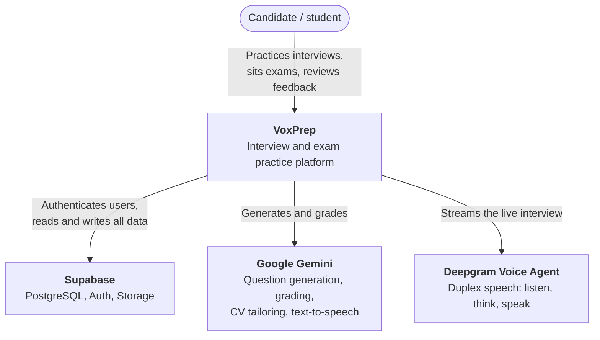
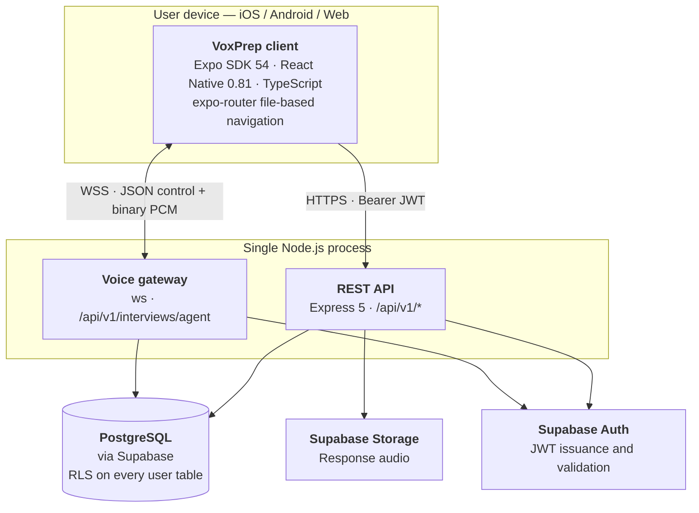
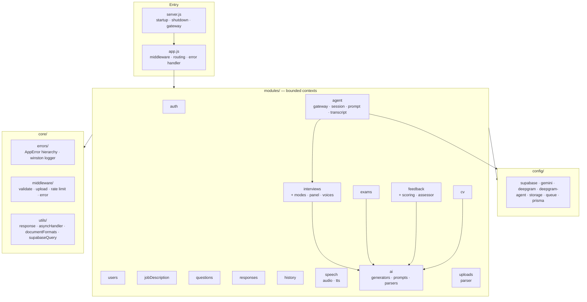
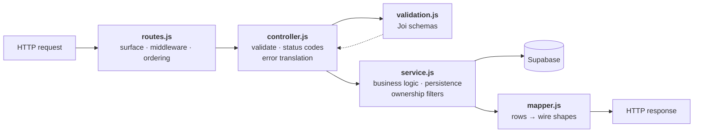
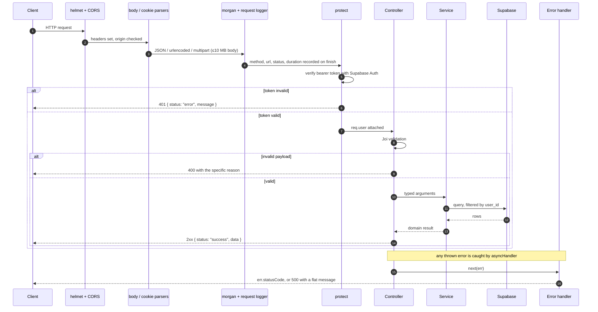
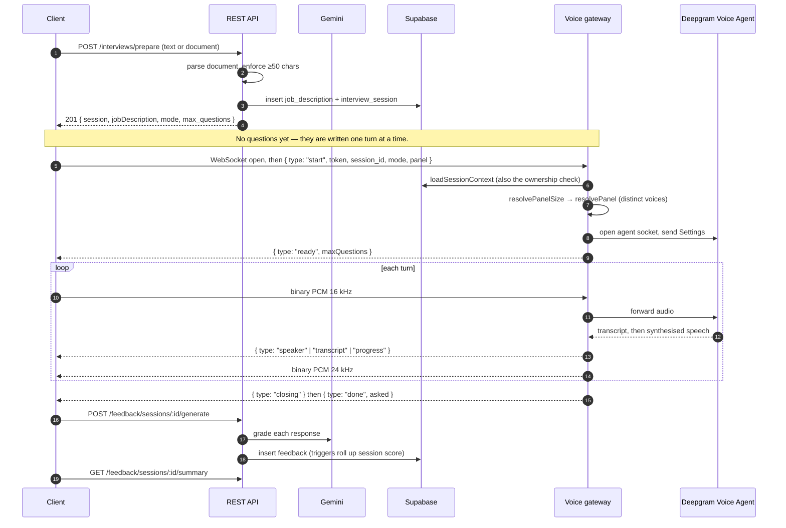
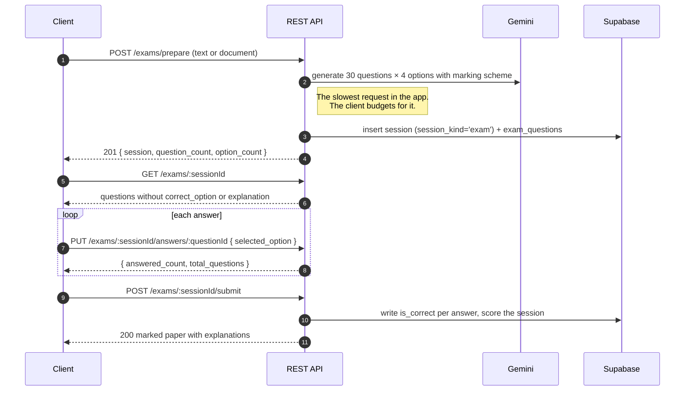
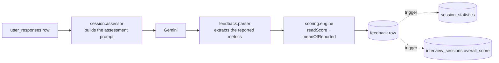

# Architecture

This document explains how VoxPrep is put together and why. It is written for
someone who needs to change the system, not merely use it.

Views follow the [C4 model](https://c4model.com/): system context, then
containers, then components, then the flows that cut across them.

## Table of contents

- [System context](#system-context)
- [Containers](#containers)
- [Backend components](#backend-components)
- [Module anatomy](#module-anatomy)
- [Request lifecycle](#request-lifecycle)
- [Key flows](#key-flows)
- [Cross-cutting concerns](#cross-cutting-concerns)
- [Design positions](#design-positions)

## System context

VoxPrep owns no identity system, no model, and no speech stack. It owns the
**domain**: what a practice session is, how a panel behaves, what makes a
question markable, and what a candidate is told afterwards.

## Containers

### One process, one port

`server.js` creates the HTTP server, and `attachAgentGateway(server)` binds the
WebSocket gateway to the same listener via a manual `upgrade` handler.

This is a deliberate choice with a practical justification: one port is one
firewall rule, one tunnel, and one URL for the client to derive. The client
builds its socket URL from its REST base URL
(`agentSocketUrl()` in `frontend/lib/api-client.ts`), so the development-time
host detection that follows the Expo dev server applies to the socket too. A
separately configured socket URL would go stale the first time the developer's
laptop changed IP, and the failure would present as "the interviewer never
speaks".

The gateway uses `noServer: true` with an explicit path check rather than
`{ server, path }`, so a future second WebSocket path is not swallowed by a
server-wide handler.

## Backend components

### Responsibility of each module

| Module | Owns |
| --- | --- |
| `auth` | Supabase Auth integration, the `protect` middleware, rate limiters, token refresh, OAuth, email verification, password reset |
| `users` | The authenticated user's own profile, activation flag, account deletion |
| `jobDescription` | Source material: pasted text or a parsed document, with skills and full-text search |
| `interviews` | Session lifecycle, one-shot `prepare`, per-turn question generation, retakes; and the mode / panel / voice registries |
| `exams` | Written paper generation, sitting, arithmetic marking, retakes |
| `questions` | Bulk question generation outside the live loop |
| `responses` | Candidate answers and per-session completion statistics |
| `feedback` | Grading, the pure scoring engine, session assessment and summaries |
| `history` | Reviewable (completed or paused) sessions, notes, archiving, aggregate stats |
| `cv` | CV tailoring against a session's job description |
| `speech` | Asynchronous transcription, text-to-speech, voice and format catalogues |
| `agent` | The live voice session: gateway, per-session state machine, prompt assembly, transcript handling |
| `ai` | Provider-facing generation, prompt templates, and response parsing |
| `uploads` | Document text extraction across all accepted formats |

`interviews/modes.js` is worth singling out. It holds the **server half** of
each practice mode — persona, question mix, and generation rules — while
`frontend/constants/modes.ts` holds the display half. The split is intentional:
the persona and the rules that make a question markable should never leave the
server. The `id` values are the contract between the two halves and must stay
in sync.

## Module anatomy

Every backend module uses the same five-file shape:

Three rules follow from this, and they are enforced in review:

1. **Nothing reaches a client except through a mapper.** This is what keeps a
   marking scheme out of a paper being sat: `mapSittingQuestion` simply has no
   field for `correct_option` or `explanation`, which is a stronger guarantee
   than remembering to delete them. `mapMarkedQuestion` adds them back once the
   paper has been marked.
2. **Ownership is checked in the service** with an explicit `user_id` filter.
   Row-level security is defence in depth — most reads use the service-role
   client, which bypasses RLS by design.
3. **Controllers translate errors into accurate status codes.** A session that
   cannot be continued must read to the candidate as a refusal, not as a server
   fault. Only genuinely unanticipated failures reach the global handler as 500s.

### Route ordering

Express matches routes in registration order, so static segments are registered
before parametric ones at the same depth. Concrete cases in this codebase:

| Registered first | Would otherwise be captured as |
| --- | --- |
| `POST /interviews/prepare` | `:id` |
| `POST /exams/prepare` | `:sessionId` |
| `GET /history/stats` | `:id` |
| `GET /responses/health` | `:id` |
| `GET /responses/sessions/:id/stats` | `:questionId` |
| `GET /cv/sessions/:sessionId` | `:id` |

## Request lifecycle

The error handler's rule is stated in `app.js` and is worth repeating: an error
that named its own status said something deliberate about what the client
should do, so its message is passed through. Anything arriving without a status
is a fault nobody anticipated, and its message is an internal detail —
*"JWT issued at future"* is what a user was once shown for a momentary clock
difference between two machines at Supabase. Those become one flat line, and the
real text goes to the log.

## Key flows

### Preparing and running a spoken interview

Two properties of this flow matter for anyone changing it:

- **Questions are not generated up front.** `prepare` returns a session and no
  questions. Each question is written against what the candidate has already
  said. `prepareSessionValidation` still *accepts* `questionCount` and ignores
  it, so an older client's setup request is not rejected outright.
- **`mode` rides on every turn** rather than being stored on the session. It
  shapes the interviewer's persona only, `interview_sessions` has no column for
  it, and a migration to persist a prompt detail was not judged worth the
  coupling.

### Setting and marking a written exam

Marking is arithmetic, not model-driven, and `is_correct` is **written at
marking time** rather than derived on every read: the paper it was marked
against is what the result must keep reporting, even if a question is later
corrected.

### Grading a spoken answer

The scoring engine is pure — no database, no Express, no AI SDK — so it can be
unit tested in isolation. Its central rule: **null is not zero.**
`technical_accuracy_score` is optional in the assessment schema, so a grader
reading a behavioural answer routinely omits it. Recording that as 0 would
assert the candidate scored nothing on it and drag a five-metric average down
by a fifth over a question that was never technical. Unreported metrics are left
out of averages instead.

## Cross-cutting concerns

### Authentication

Every protected route runs `protect`, which validates the bearer token against
Supabase Auth and attaches `req.user`. The client refreshes transparently: a
401 triggers a single refresh, concurrent requests queue behind it, and the
original request is retried once. Logout, login, and refresh calls are excluded
— there is no useful refresh flow when the refresh itself is what failed.

A refresh failure that is a *network* failure does **not** sign the user out.
Wiping tokens for being briefly offline is a worse outcome than a failed
request.

### Document ingestion

`core/utils/documentFormats.js` is a single registry read by both ends of the
same journey: the multer `fileFilter` decides whether to accept the bytes, and
the parser decides which extractor to run. Split across two files they drifted,
and a file the server would happily parse could not be chosen in the picker.

**Extension is the primary key, not MIME type.** React Native uploads frequently
carry `application/octet-stream` — some Android document providers report no
type at all and the client fills in a placeholder so the multipart body is
well-formed. The filename survives that trip intact.

Accepted: PDF, DOC, DOCX, ODT, RTF, TXT, MD, CSV, PPTX, ODP, XLSX, ODS. Legacy
binary `.ppt` and `.xls` are named explicitly so a student who picks one is told
to re-save it rather than shown a generic list.

### Panel voices

A panel whose members share a voice is a panel of one wearing several names.
Two things cause it: a stale client sending a voice id the catalogue no longer
has (`resolveVoice` answers unknown ids with the default, so two unknowns
collapse to one voice), and a hand-rolled client sending the same id twice.

`resolvePanel` resolves collisions **against the catalogue rather than
reporting them**, preferring a voice of the same apparent gender so a
substitution does not silently re-cast a panelist. A colleague in an unexpected
voice is a far smaller failure than a colleague who is audibly the chair.

The client sends a roster; the mode has the final say on size. A consular
interview is one officer at one window whatever the client asked for, and a
stale or hand-rolled client cannot talk the server into a panel of nine
(`MAX_PANEL_SIZE = 4`).

### Voice indirection

`frontend/constants/interviewers.ts` gives each panelist a stable `voiceId`
(`f_warm_01`), and `interviews/voices.js` resolves it to a real TTS voice. The
roster is a product decision; the voice catalogue is a vendor detail. The move
from Deepgram Aura to Gemini changed only that one server file — no app release
was required.

### Logging

`morgan` logs the HTTP line; a custom middleware records method, URL, status,
and duration on `finish` through the winston-backed logger in
`core/errors/logger.js`. Stack traces appear in responses only when
`NODE_ENV === 'development'`.

### Graceful shutdown

`SIGTERM` and `SIGINT` close the HTTP server and exit, with a 10-second forced
shutdown as a backstop. Uncaught exceptions and unhandled rejections are logged
and trigger the same path.

## Design positions

These are recorded as full [Architecture Decision Records](adr/):

| ADR | Decision |
| --- | --- |
| [0001](adr/0001-single-process-rest-and-websocket.md) | REST and the voice gateway share one process and one port |
| [0002](adr/0002-separate-tables-for-written-exams.md) | Written exams get their own tables, sharing only the session |
| [0003](adr/0003-authenticate-websocket-in-first-message.md) | The WebSocket authenticates in its first message, not the URL |
| [0004](adr/0004-per-turn-question-generation.md) | Interview questions are generated per turn, not up front |
| [0005](adr/0005-do-not-store-cv-source-text.md) | Extracted CV text is never persisted |
| [0006](adr/0006-indirect-voice-identifiers.md) | The client names voices by stable id; the server maps them to vendors |
| [0007](adr/0007-unreported-scores-are-null-not-zero.md) | Unreported grading metrics are null and excluded from averages |
