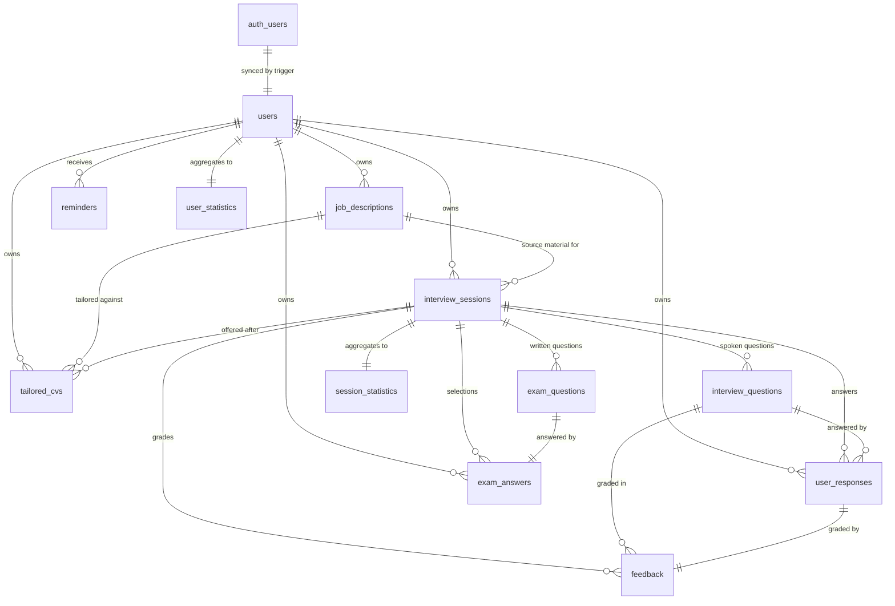

# Data model

The PostgreSQL schema behind VoxPrep, hosted on Supabase. Source of truth:
`backend/supabase_schema.sql` (fresh projects) and `backend/migrations/`
(existing databases).

All timestamps are `TIMESTAMP WITH TIME ZONE` and serialise as
[ISO 8601](https://www.iso.org/iso-8601-date-and-time-format.html) UTC. All
primary keys are `UUID`, defaulted with `gen_random_uuid()` except `users.id`,
which is the Supabase Auth id.

## Table of contents

- [Entity relationships](#entity-relationships)
- [Tables](#tables)
- [Row-level security](#row-level-security)
- [Triggers](#triggers)
- [Views](#views)
- [Migrations](#migrations)
- [Design notes](#design-notes)

## Entity relationships



`interview_sessions` is the hinge. Both a spoken interview and a written exam
are rows in it, distinguished by `session_kind`, so history, statistics, and the
dashboard count both without knowing which is which — they read `session_kind`
only to send the user to the right review screen.

## Tables

### `users`

Mirrors `auth.users`. Kept in sync by a `SECURITY DEFINER` trigger so the
application can join against user rows without querying the auth schema.

| Column | Type | Notes |
| --- | --- | --- |
| `id` | `UUID` PK | References `auth.users(id)`, cascade delete |
| `email` | `VARCHAR(255)` | Unique, `NOT NULL`, regex-checked |
| `full_name` | `VARCHAR(255)` | From `raw_user_meta_data.full_name` |
| `created_at`, `updated_at` | `TIMESTAMPTZ` | `updated_at` maintained by trigger |
| `last_login` | `TIMESTAMPTZ` | From `auth.users.last_sign_in_at` |
| `is_active` | `BOOLEAN` | Default `true`. See the caveat below |
| `profile_completed` | `BOOLEAN` | Default `false` |
| `avatar_url`, `avatar_updated_at` | | |

Indexes: `email`, `created_at`, `is_active`.

> Setting `is_active = false` does **not** invalidate an outstanding JWT. The
> client must also call `POST /auth/logout`. Documented as a known limitation in
> [`SECURITY.md`](../SECURITY.md#known-limitations).

### `job_descriptions`

The source material for a session: a job posting, a thesis abstract, visa
application details, or course notes, depending on mode.

| Column | Type | Notes |
| --- | --- | --- |
| `id` | `UUID` PK | |
| `user_id` | `UUID` | → `users(id)`, cascade |
| `title` | `VARCHAR(255)` | `NOT NULL` |
| `company_name` | `VARCHAR(255)` | |
| `job_content` | `TEXT` | `NOT NULL`, length > 0. API enforces ≥ 50 characters |
| `key_skills` | `TEXT[]` | GIN-indexed for skill lookups |
| `required_experience_level` | `VARCHAR(50)` | `entry`, `junior`, `mid`, `senior`, `lead` |
| `industry` | `VARCHAR(100)` | |
| `search_vector` | `TSVECTOR` | Generated, stored. Weights: title `A`, company `B`, content `C` |
| `created_at`, `updated_at`, `is_active` | | `updated_at` maintained by trigger |

Indexes: `user_id`, `created_at`, `is_active`, `(user_id, is_active)`,
GIN on `key_skills`, GiST on `search_vector`.

### `interview_sessions`

One practice attempt, spoken or written.

| Column | Type | Notes |
| --- | --- | --- |
| `id` | `UUID` PK | |
| `user_id` | `UUID` | → `users(id)`, cascade |
| `job_description_id` | `UUID` | → `job_descriptions(id)`, `SET NULL` on delete |
| `session_title` | `VARCHAR(255)` | |
| `status` | `VARCHAR(50)` | `in_progress` \| `completed` \| `paused` |
| `session_kind` | `VARCHAR(20)` | `interview` \| `exam`. Default `interview` |
| `total_questions`, `questions_answered` | `INTEGER` | |
| `overall_score` | `DECIMAL(5,2)` | 0–100, maintained by trigger for interviews |
| `started_at`, `completed_at` | `TIMESTAMPTZ` | |
| `duration_seconds` | `INTEGER` | |
| `is_archived` | `BOOLEAN` | |
| `notes` | `TEXT` | User's own notes |

Indexes: `user_id`, `(user_id, session_kind)`, `status`, `started_at DESC`,
`(user_id, status)`, `completed_at`.

**Practice mode is not stored here.** It is supplied per generation request and
influences only the prompt. Persisting it would require a migration, and nothing
downstream reads it back.

### `interview_questions`

Spoken questions. Written one at a time during the interview.

| Column | Type | Notes |
| --- | --- | --- |
| `id` | `UUID` PK | |
| `session_id` | `UUID` | → `interview_sessions(id)`, cascade |
| `question_number` | `INTEGER` | Order in the session |
| `question_type` | `VARCHAR(50)` | `behavioral` \| `technical` \| `situational` \| `general` |
| `question_text` | `TEXT` | `NOT NULL`, length > 0 |
| `ideal_answer_guidelines` | `TEXT` | |
| `difficulty_level` | `VARCHAR(50)` | `easy` \| `medium` \| `hard` |
| `generated_at` | `TIMESTAMPTZ` | |
| `ai_model_used` | `VARCHAR(100)` | Which model wrote it |

### `exam_questions`

One question on a written paper, with its options and marking scheme.

| Column | Type | Notes |
| --- | --- | --- |
| `id` | `UUID` PK | |
| `session_id` | `UUID` | → `interview_sessions(id)`, cascade |
| `question_number` | `INTEGER` | Unique per session |
| `question_text` | `TEXT` | `NOT NULL`, length > 0 |
| `options` | `JSONB` | `[{ "label": "A", "text": "…" }, …]` |
| `correct_option` | `VARCHAR(2)` | e.g. `"C"` |
| `explanation` | `TEXT` | Shown after marking |
| `topic` | `VARCHAR(120)` | Which part of the material it came from |
| `difficulty_level` | `VARCHAR(50)` | Default `medium` |
| `ai_model_used`, `generated_at` | | |

`options` is `JSONB` rather than a child table because options are never
queried, filtered, or joined on — they are read and written as one unit with the
question, and always in full.

> `correct_option` and `explanation` never reach a paper being sat.
> `mapSittingQuestion` has no field for them; `mapMarkedQuestion` adds them back
> after submission.

### `exam_answers`

What the student selected. One row per question — `UNIQUE (question_id)`, so
changing your mind updates the row.

| Column | Type | Notes |
| --- | --- | --- |
| `id` | `UUID` PK | |
| `question_id` | `UUID` | → `exam_questions(id)`, cascade, unique |
| `session_id` | `UUID` | → `interview_sessions(id)`, cascade |
| `user_id` | `UUID` | → `users(id)`, cascade |
| `selected_option` | `VARCHAR(2)` | `NOT NULL` |
| `is_correct` | `BOOLEAN` | `NULL` until marked |
| `answered_at` | `TIMESTAMPTZ` | |

`is_correct` is **written at marking time**, not derived on read. The paper it
was marked against is what the result must keep reporting, even if a question is
later corrected.

### `user_responses`

A spoken answer, after transcription.

| Column | Type | Notes |
| --- | --- | --- |
| `id` | `UUID` PK | |
| `question_id` | `UUID` | → `interview_questions(id)`, cascade |
| `session_id`, `user_id` | `UUID` | cascade |
| `original_audio_url` | `VARCHAR(512)` | Supabase Storage URL, when audio was retained |
| `storage_path` | `VARCHAR(2048)` | Bucket path |
| `detected_language` | `VARCHAR(64)` | From speech-to-text |
| `request_id` | `VARCHAR(255)` | Provider request id, for support |
| `transcribed_text` | `TEXT` | `NOT NULL`, length > 0 |
| `response_duration_seconds` | `INTEGER` | |
| `transcription_confidence` | `DECIMAL(3,2)` | 0–1, constrained |
| `response_created_at` | `TIMESTAMPTZ` | |

### `feedback`

AI grading for one response. `UNIQUE(response_id)` prevents duplicates.

| Column | Type | Notes |
| --- | --- | --- |
| `id` | `UUID` PK | |
| `response_id` | `UUID` | → `user_responses(id)`, unique, cascade |
| `session_id`, `question_id` | `UUID` | cascade |
| `relevance_score` | `DECIMAL(5,2)` | 0–100 |
| `clarity_score` | `DECIMAL(5,2)` | 0–100 |
| `confidence_score` | `DECIMAL(5,2)` | 0–100 |
| `completeness_score` | `DECIMAL(5,2)` | 0–100 |
| `overall_response_score` | `DECIMAL(5,2)` | Mean of the **reported** sub-scores |
| `strengths`, `improvements`, `suggestions`, `follow_up_tip` | `TEXT` | |
| `generated_at`, `ai_model_used` | | |

Every score column is nullable and range-constrained. **Null means the grader
did not report that dimension** — it is excluded from the average rather than
counted as zero. See
[ADR-0007](adr/0007-unreported-scores-are-null-not-zero.md).

`technical_accuracy_score` exists in the assessment schema and is handled by the
scoring engine but has no dedicated column; it reaches clients through the
feedback mapper.

### `session_statistics`

Per-session aggregates, `UNIQUE(session_id)`, maintained by trigger:
average relevance / clarity / confidence / completeness, average response time,
total speaking time, answered and skipped counts, and `top_strengths` /
`areas_to_improve` as `TEXT[]`.

### `user_statistics`

Per-user aggregates, `UNIQUE(user_id)`: total and completed sessions, total
questions answered, average / best / worst session score, last session date,
streak days, and best / weakest question type.

### `tailored_cvs`

A CV rewritten against one job description.

| Column | Type | Notes |
| --- | --- | --- |
| `id` | `UUID` PK | |
| `user_id` | `UUID` | cascade |
| `session_id` | `UUID` | → `interview_sessions(id)`, cascade |
| `job_description_id` | `UUID` | `SET NULL` on delete |
| `source_file_name` | `VARCHAR(255)` | Display only |
| `source_char_count` | `INTEGER` | Length of the extracted text |
| `tailored_document` | `JSONB` | The CV: summary, skills, experience, education, … |
| `tailoring_notes` | `TEXT[]` | What changed and why it helps |
| `keywords_matched` | `TEXT[]` | Job terms the CV now evidences |
| `gaps` | `TEXT[]` | Requirements it does not evidence, stated honestly |
| `ai_model_used`, `created_at`, `updated_at` | | |

**Note what is absent: the extracted CV text.** It is the most sensitive
material this feature touches — full employment history, address, phone number
— and nothing downstream needs it once the model has read it, so it is never
written down. Only the length is kept, for support and diagnostics. See
[ADR-0005](adr/0005-do-not-store-cv-source-text.md).

The read path is "the latest CV for this session", so
`idx_tailored_cvs_session_created` carries the `created_at DESC` ordering.

### `reminders`

Scheduled nudges: `reminder_type` ∈ `practice_reminder`, `session_review`,
`milestone`, `general`; plus `title`, `message`, `scheduled_at`, `sent_at`,
`is_read`.

### `audit_log`

`user_id` (nullable, `SET NULL`), `action`, `resource_type`, `resource_id`,
`details JSONB`, `ip_address INET`, `user_agent`, `created_at`.

## Row-level security

RLS is enabled on every user-data table: `users`, `job_descriptions`,
`interview_sessions`, `interview_questions`, `user_responses`, `feedback`,
`session_statistics`, `reminders`, `user_statistics`, `tailored_cvs`,
`exam_questions`, `exam_answers`.

Two policy shapes are used:

**Direct ownership** — the row carries `user_id`:

```sql
CREATE POLICY user_responses_select_own ON user_responses
  FOR SELECT USING (auth.uid() = user_id);
```

**Ownership through the session** — the row belongs to a session that belongs to
the user:

```sql
CREATE POLICY exam_questions_select_own ON exam_questions
  FOR SELECT USING (
    EXISTS (
      SELECT 1 FROM interview_sessions s
      WHERE s.id = exam_questions.session_id AND s.user_id = auth.uid()
    )
  );
```

> **RLS is defence in depth, not the primary authorization control.** The API
> reads most tables through the service-role client, which bypasses RLS by
> design, and enforces ownership with explicit `user_id` filters in the service
> layer. These policies are what stands between a user and someone else's data
> if the publishable key is ever used directly. Both layers must be maintained.

## Triggers

| Trigger | On | Does |
| --- | --- | --- |
| `sync_auth_user_to_public_user` | `AFTER INSERT OR UPDATE` on `auth.users` | Upserts into `public.users`. `SECURITY DEFINER` with `search_path = ''` |
| `users_update_timestamp` | `BEFORE UPDATE` on `users` | Sets `updated_at` |
| `job_descriptions_update_timestamp` | `BEFORE UPDATE` on `job_descriptions` | Sets `updated_at` |
| `feedback_calculate_stats` | `AFTER INSERT` on `feedback` | Upserts averaged metrics into `session_statistics` |
| `feedback_update_session_score` | `AFTER INSERT OR UPDATE` on `feedback` | Recomputes `interview_sessions.overall_score` |

The last two mean session and statistics scores are a **consequence of writing
feedback**. Inserting a feedback row updates two other tables; application code
must not also write those values, or the two will disagree.

## Views

| View | Purpose |
| --- | --- |
| `user_interview_history` | Sessions joined with job title, company, question count, and average score |
| `session_performance_summary` | Per-session totals and averaged metrics |
| `user_progress_tracking` | Per-user totals, completion counts, and overall average |

## Migrations

`supabase_schema.sql` describes a **fresh** project. It is not idempotent — its
`CREATE INDEX` and `CREATE POLICY` statements cannot be re-run over a live
database.

Changes to an existing database go in `backend/migrations/YYYY-MM-DD_<change>.sql`,
written so it can be pasted into the Supabase SQL editor safely, **including
twice**:

- `CREATE TABLE IF NOT EXISTS`, `CREATE INDEX IF NOT EXISTS`,
  `ADD COLUMN IF NOT EXISTS`
- `DROP POLICY IF EXISTS` immediately before each `CREATE POLICY`
- constraints added inside a guarded block:

```sql
DO $$
BEGIN
  IF NOT EXISTS (SELECT 1 FROM pg_constraint WHERE conname = 'session_kind_valid') THEN
    ALTER TABLE interview_sessions
      ADD CONSTRAINT session_kind_valid CHECK (session_kind IN ('interview', 'exam'));
  END IF;
END $$;
```

**Every schema change requires both edits in the same commit:** update
`supabase_schema.sql` so new projects get it, and add the dated migration so
existing ones do.

Applied so far:

| File | Change |
| --- | --- |
| `2026-08-20_tailored_cvs.sql` | Adds `tailored_cvs` with indexes and RLS policies |
| `2026-08-21_exams.sql` | Adds `session_kind` to `interview_sessions`; creates `exam_questions` and `exam_answers` with indexes and RLS |

## Design notes

### Why exams have their own tables

An exam question is not an interview question with extra columns. It carries its
own options and marking scheme, it is answered by choosing rather than by
speaking, and it is marked arithmetically rather than by a model. Bolting
options and a correct answer onto `interview_questions` would put four
always-null columns on every interview row and give the grader a second shape to
reason about.

What *is* shared is the session, which is why `session_kind` exists: it is the
one bit history, statistics, and the dashboard need in order to send the user to
the right review. Full reasoning in
[ADR-0002](adr/0002-separate-tables-for-written-exams.md).

### Why `search_vector` is generated and stored

Job-description search is a read-heavy path with rare writes. A generated stored
column keeps the vector correct by construction — it cannot drift from
`job_content` the way a trigger-maintained column can — at the cost of storage
that is small next to the text itself.

### Cascade choices

Deleting a user removes everything they own. Deleting a job description
**nulls** `interview_sessions.job_description_id` rather than deleting the
session, because a completed session with its feedback is a record the user
earned and should not lose by tidying up their source material. The same
reasoning applies to `tailored_cvs.job_description_id`.
