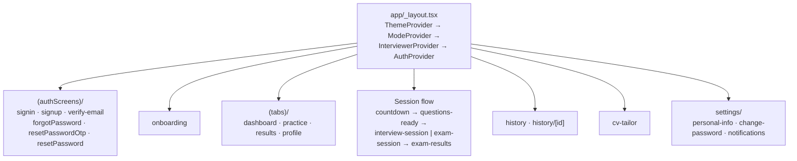
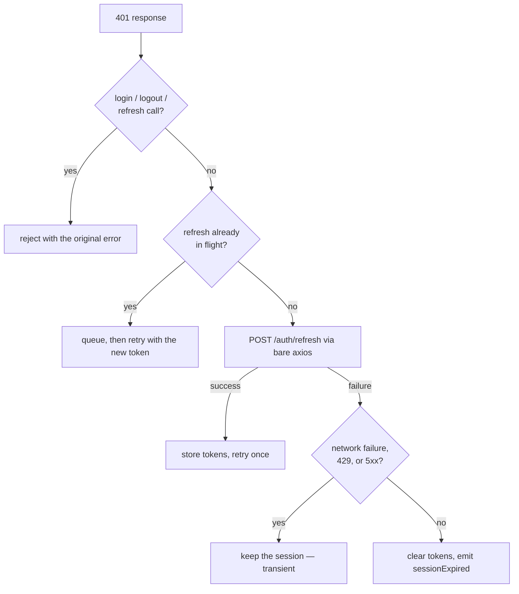

# Frontend guide

The VoxPrep client: Expo SDK 54, React Native 0.81, React 19, TypeScript,
`expo-router` file-based navigation. Targets iOS, Android, and web from one
codebase.

## Table of contents

- [Layout](#layout)
- [Navigation](#navigation)
- [Screens](#screens)
- [State](#state)
- [Services](#services)
- [The API client](#the-api-client)
- [Shared constants](#shared-constants)
- [Theming](#theming)
- [Live voice on the client](#live-voice-on-the-client)
- [Native requirements](#native-requirements)
- [Contracts shared with the server](#contracts-shared-with-the-server)
- [Development workflow](#development-workflow)

## Layout

```
frontend/
├── app/            Routes — file name is the URL (expo-router)
├── components/     Shared presentational components
├── constants/      Modes, interviewer roster, theme, upload rules
├── hooks/          Context providers and custom hooks
├── lib/            API client, token storage, formatting, PDF export
├── services/       One typed module per API area
├── types/          Shared TypeScript contracts
├── assets/         Images, fonts, icons
├── app.json        Expo configuration, plugins, permissions
└── eas.json        EAS build profiles
```

Path alias: `@/` → the `frontend/` root. Import `@/lib/api-client`, not
`../../lib/api-client`.

`app-example/` is the `create-expo-app` starter, kept only as a reference for
`npm run reset-project`. It is not part of the application.

## Navigation

Routing is by file path. `app/_layout.tsx` composes the providers and owns the
top-level redirect.



### The redirect rule

`_layout.tsx` sends signed-out users to `/(authScreens)/signin` and signed-in
users to `/(tabs)/dashboard`. A list of route groups is **exempt** because they
manage their own navigation:

`(authScreens)`, `settings`, `history`, `countdown`, `questions-ready`,
`interview-session`, `exam-session`, `exam-results`, `cv-tailor`.

The interview flow is in that list because it runs outside the tab group.
Without the exemption, the redirect would pull the user back to the dashboard
the moment a session started.

### The profile-completion flag

Setup was once two screens standing between signing in and the app, and
finishing them marked the profile complete. Those choices are now filters on the
practice screen, so nothing gates entry — but the server-side flag still exists
and is one-way. It is settled once, in the background, the first time a
signed-in user reaches the app. **Nothing waits on it**: a failure costs a retry
on the next launch, not the session.

## Screens

| Route | Purpose |
| --- | --- |
| `index` | Entry; routes onward based on auth state |
| `onboarding` | First-run introduction |
| `(authScreens)/signin` | Email/password and Google sign-in |
| `(authScreens)/signup` | Registration |
| `(authScreens)/verify-email` | Email confirmation |
| `(authScreens)/forgotPassword` | Request a reset |
| `(authScreens)/resetPasswordOtp` | Enter the emailed OTP |
| `(authScreens)/resetPassword` | Set a new password |
| `(tabs)/dashboard` | Overview and progress |
| `(tabs)/practice` | **Session setup.** Mode, panel, source material |
| `(tabs)/results` | Recent scores |
| `(tabs)/profile` | Account and settings entry |
| `countdown` | Pre-session countdown |
| `questions-ready` | Confirmation that the session is prepared |
| `interview-session` | **The live spoken interview** |
| `exam-session` | **Sitting a written paper** |
| `exam-results` | Marked paper with explanations |
| `history` | Past sessions |
| `history/[id]` | Full review: questions, answers, feedback |
| `cv-tailor` | Upload a CV and read it back rewritten |
| `settings/personal-info` | Edit profile |
| `settings/change-password` | Change password |
| `settings/notifications` | Notification preferences |

## State

Four React contexts, composed in `app/_layout.tsx` in this order:

```
ThemeProvider → ModeProvider → InterviewerProvider → AuthProvider
```

| Provider | Hook | Holds |
| --- | --- | --- |
| `theme-context` | `useColorScheme()` | Colour scheme, light/dark/system |
| `mode-context` | `useMode()` | The selected practice mode and its vocabulary |
| `interviewer-context` | — | Panel size, lead gender, resolved roster |
| `auth-context` | `useAuth()` | `user`, `isSignedIn`, `isInitializing`, `error`, and the auth actions |

`useAuth()` exposes `signup`, `login`, `googleSignIn`, `logout`, `clearError`,
and `updateUser`. `isInitializing` is distinct from `isLoading`: the first is
"we do not yet know whether there is a session", the second is "a request is in
flight". The root layout renders nothing while initializing, so the app never
flashes the sign-in screen at a signed-in user.

`lib/session-events.ts` carries a session-expired signal from the API client's
interceptor into `auth-context`, which is what lets a token rejection anywhere
in the app sign the user out cleanly.

Other hooks:

| Hook | Purpose |
| --- | --- |
| `use-agent-session` | Drives the live voice interview: socket, events, playback |
| `use-history` | Fetches and paginates past sessions |
| `use-theme-color` | Resolves a themed colour |

## Services

One module per API area, in `services/`. Screens call services; they do not call
axios.

| Module | Wraps |
| --- | --- |
| `auth.ts` | `/auth/*` |
| `user.ts` | `/users/*` |
| `interview.ts` | `/interviews/*` |
| `exam.ts` | `/exams/*` |
| `speech.ts` | `/speech/*` |
| `history.ts` | `/history/*` |
| `cv.ts` | `/cv/*` |
| `voice-agent.ts` | The WebSocket voice session — not REST |
| `error-handler.ts` | Turns axios failures into typed, displayable errors |

`lib/` holds non-service helpers:

| Module | Purpose |
| --- | --- |
| `api-client.ts` | The single axios instance; base URL, auth, refresh |
| `token-storage.ts` | Persisted tokens and cached user |
| `session-events.ts` | Session-expired event bus |
| `prepared-session.ts` | Carries a prepared session between setup and the session screen |
| `active-exam.ts` | Local state for a paper in progress |
| `feedback-view.ts` | Shapes feedback for display |
| `cv-html.ts` / `cv-pdf.ts` | Render and export a tailored CV via `expo-print` |
| `format.ts` | Dates, durations, scores |

## The API client

`lib/api-client.ts` is the only place axios is configured. Everything else
imports the instance.

### Base URL resolution

```
__DEV__ ? (Expo host + port/path from EXPO_PUBLIC_API_URL)
        : EXPO_PUBLIC_API_URL
        ?? http://localhost:5050/api/v1
```

A hard-coded LAN IP silently breaks whenever DHCP hands out a new lease, and the
failure surfaces as an opaque `ERR_NETWORK`. The Expo dev server host is always
correct — the device is connected to it right now — so in development the client
derives the API host from it and reuses only the port and path from the
configured URL. Tunnel hosts (`exp.direct`) are skipped, because the backend is
not reachable through them.

The WebSocket URL is derived from the same base
(`agentSocketUrl()`), so there is no second setting to go stale.

### Request interceptor

- Attaches `Authorization: Bearer <access_token>` when one is stored.
- **Deletes** `Content-Type` when the body is `FormData`. The instance defaults
  to `application/json`, which would mislabel an upload; setting
  `"multipart/form-data"` by hand produces a boundary-less header that multer
  rejects. Deleting it lets React Native's networking layer write the type
  together with the boundary it generates.

### Response interceptor



Three decisions worth knowing:

- **Refresh goes through a bare axios call**, not the instance. The instance's
  interceptors would attach the expired token and, on failure, recurse straight
  back into this handler.
- **Only a rejected refresh token ends the session.** A network failure, a
  `429`, or a `5xx` is transient; wiping the tokens would sign the user out for
  being briefly offline.
- **One retry per request.** `_retry` guards against loops.

## Shared constants

| File | Contents |
| --- | --- |
| `constants/modes.ts` | The **display half** of practice modes: labels, placeholders, per-mode vocabulary, format, panel rules |
| `constants/interviewers.ts` | The interviewer roster, panel sizes, voice ids, avatars |
| `constants/theme.ts` | Colour tokens and typography |
| `constants/uploads.ts` | Accepted document types for the picker |

**Mode is to copy what colour scheme is to colours.** Screens must never
hard-code words like "interview" — they read them from `useMode()`, so choosing
Exam makes the whole app present as exam prep.

Screens branch on `ModeFormat` (`'voice'` | `'written'`), not on the mode id, so
the exam flow does not have to be taught about every new mode that joins it.

`interviewers.ts` is orthogonal to `modes.ts`: the mode decides *what* you are
asked, the roster decides *who* asks it. The user picks along two axes — how
many people, and whether the lead is a man or a woman — and
`resolveInterviewerId()` turns that pair into a roster. Rosters are explicit
rather than assembled on the fly, so each is a deliberate mix of seats and
voices.

> The avatars in `interviewers.ts` are placeholders and are expected to be
> replaced with generated or licensed portraits before release.

## Theming

`hooks/theme-context.tsx` provides the scheme; `constants/theme.ts` provides the
tokens; `useThemeColor()` resolves one. `themed-text.tsx` and `themed-view.tsx`
are the themed primitives. `app.json` sets
`userInterfaceStyle: "automatic"`, so the app follows the system by default.

## Live voice on the client

`services/voice-agent.ts` owns the socket and the audio; `hooks/use-agent-session.ts`
exposes it to the interview screen. The wire contract is documented in
[voice agent protocol](voice-agent-protocol.md).

Client-side specifics:

| Constant | Value | Why |
| --- | --- | --- |
| `MIC_SAMPLE_RATE` | 16 000 Hz | Matches the server's declared input |
| `AGENT_SAMPLE_RATE` | 24 000 Hz | Aura synthesises at 24 kHz; resampling would only lose quality |
| `MIC_FRAME_SAMPLES` | 320 (20 ms) | Small enough that a barge-in is noticed almost immediately, large enough not to spend the turn in bridge crossings |
| `ECHO_TAIL_MS` | 250 | Covers the room's own reverb, which arrives after the speaker has stopped |
| `CAN_BARGE_IN` | `Platform.OS === 'ios'` | See below |

**iOS** runs full-duplex: `voiceChat` mode puts the audio session into voice
processing, which cancels the device's own output out of the input, so the
candidate can cut in mid-question.

**Android** runs half-duplex. There is no equivalent switch exposed, and an open
microphone in front of a loudspeaker means the interviewer transcribes its own
voice as the candidate's answer and replies to itself — the interview derails
within two turns. So the microphone is muted for exactly as long as the
interviewer's audio is playing, plus the echo tail. The cost is that you cannot
interrupt mid-question; the alternative is an interview that talks to itself.

`components/voice-wave.tsx` renders the level meter fed by the `onLevel`
callback.

## Native requirements

`react-native-audio-api` is a native module, so **the live voice interview does
not run in Expo Go**. Everything else does.

```bash
npx expo run:ios          # local dev build
npx expo run:android
eas build --profile development --platform android
```

Permissions declared in `app.json`:

| Platform | Permission |
| --- | --- |
| iOS | `NSMicrophoneUsageDescription` |
| Android | `RECORD_AUDIO`, `MODIFY_AUDIO_SETTINGS`, `INTERNET` |

Also configured: `newArchEnabled: true`, `typedRoutes`, `reactCompiler`, and the
`expo-router`, `expo-splash-screen`, `expo-font`, and `react-native-audio-api`
plugins. Bundle identifier and package: `com.jhaydadzie.voxprep`.

## Contracts shared with the server

Several values are mirrored on both sides. When you change one, change the other
in the same commit and say so in the message.

| Client | Server | What must agree |
| --- | --- | --- |
| `constants/modes.ts` → `ModeId` | `modules/interviews/modes.js` → `MODE_IDS` | Mode ids |
| `constants/interviewers.ts` → `voiceId` | `modules/interviews/voices.js` → `VOICE_MAP` | Voice ids |
| `constants/uploads.ts` | `core/utils/documentFormats.js` | Accepted document formats |
| `services/voice-agent.ts` → `AgentEvent` | `modules/agent/agent.session.js` | WebSocket event shapes |
| `types/api.ts`, `types/*.ts` | `*.mapper.js` | Response shapes |

The `types/` directory (`api.ts`, `cv.ts`, `exam.ts`, `history.ts`,
`interview.ts`) is the client's declaration of what the server returns. It can
be regenerated from the OpenAPI document:

```bash
npx openapi-typescript docs/api/openapi.yaml -o frontend/types/api-generated.d.ts
```

## Development workflow

```bash
npm run frontend                 # from the repository root
# or, inside frontend/
npm start                        # Expo dev server
npm run android | ios | web      # start on a specific target
npm run lint                     # ESLint (eslint-config-expo)
node get-ip.js                   # print the LAN IP for EXPO_PUBLIC_API_URL
```

Setup and troubleshooting are in [getting started](getting-started.md).
Platform-specific notes also live in the legacy files `MOBILE_TESTING.md`,
`NETWORK_ERROR_TROUBLESHOOTING.md`, and `SIGNUP_TROUBLESHOOTING.md` in the
`frontend/` directory; where they disagree with `docs/`, `docs/` is
authoritative.
