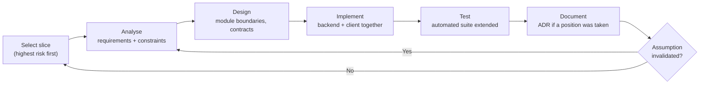
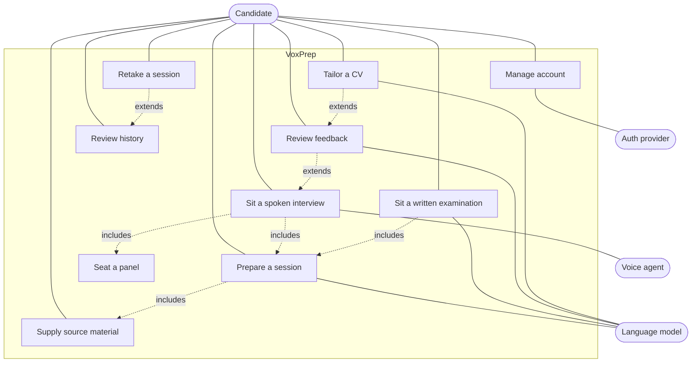
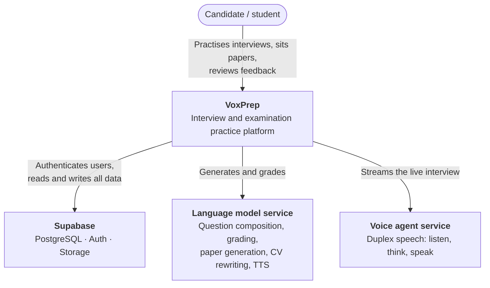
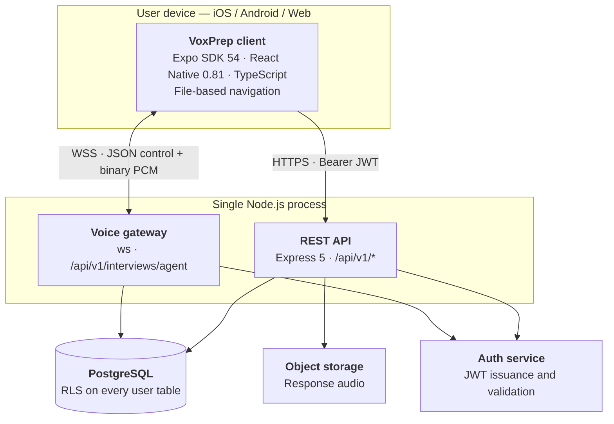
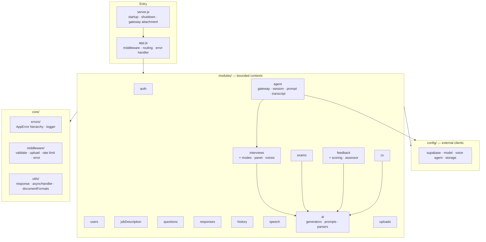
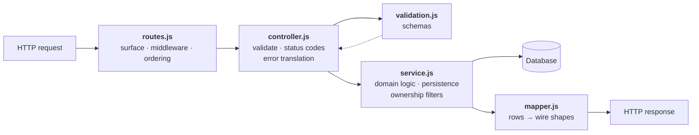
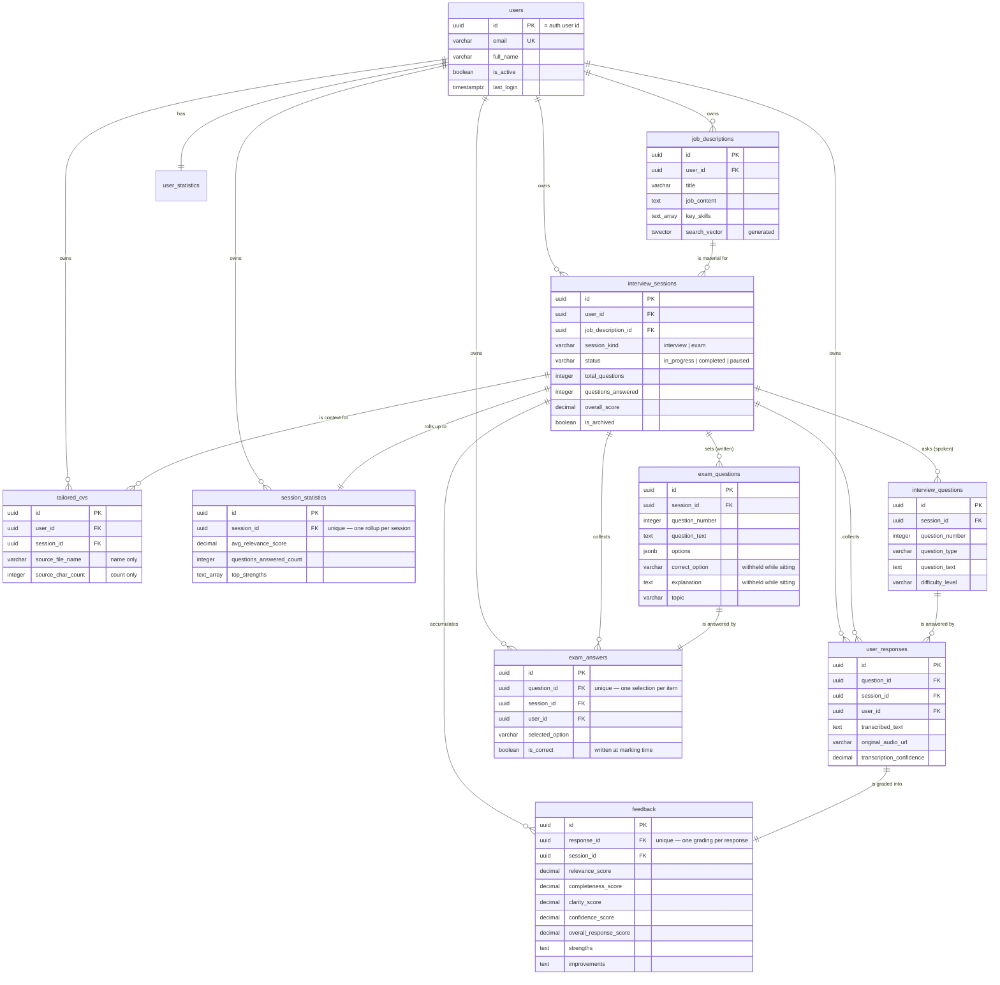
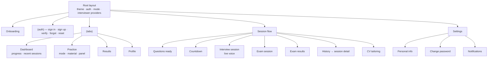
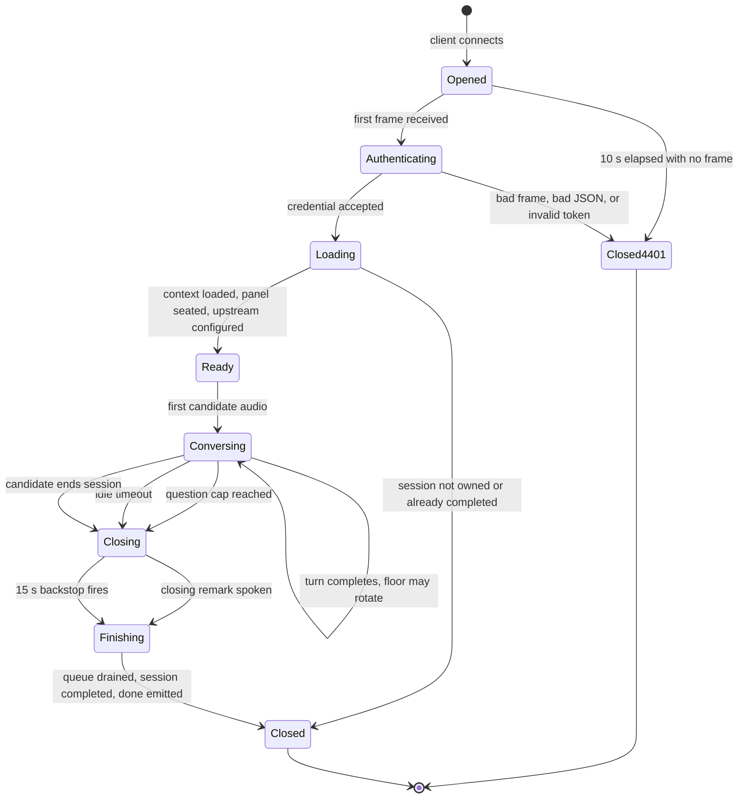

# Chapter Three — Methodology, System Analysis and Design

## 3.1 Introduction

This chapter sets out how the system was developed and how it is designed. §3.2
justifies the development methodology. §3.3–3.6 constitute the analysis:
requirements elicitation, functional and non-functional requirements, and
use-case analysis. §3.7–3.11 constitute the design: architecture, database,
interface, protocol, and security.

Architectural views follow the C4 model (Brown), presented at decreasing levels
of abstraction so that each view answers one reader's question without requiring
the next. The design is presented as decided, with the alternatives that were
rejected given where the decision was not obvious; the seven Architecture
Decision Records reproduced in Appendix C carry the full argument in each case.

## 3.2 Software Development Methodology

### 3.2.1 Selection

Three methodologies were considered against the character of the project: a
single developer, a fixed academic deadline, requirements that were clear in
outline but not in detail, and — decisively — a central technical uncertainty.
It was not known at the outset whether question composition, speech recognition,
and speech synthesis could be completed inside the turn-taking window that makes
a spoken exchange feel like a conversation (RQ1). If they could not, the design
would have to change fundamentally.

**Waterfall** was rejected on that ground. A methodology that completes design
before construction requires that the feasibility of the design be knowable in
advance. Here it was not, and a full design premised on an assumption that
proved false would have been discovered late and at maximum cost.

**Scrum** was rejected on a different ground. Its ceremonies — sprint planning,
daily stand-up, review, retrospective — coordinate a team, and their value is
proportional to the number of people needing coordination. For one developer
they are overhead without a corresponding benefit.

**An iterative and incremental process** with time-boxed cycles was adopted,
drawing on the Agile Manifesto's principles (Beck et al., 2001) without adopting
a specific framework's ceremonies. Each cycle selected a slice of functionality
that could be exercised end to end, implemented it across both deployables,
tested it, and documented what was learned. The highest-risk slice was taken
first.

**Figure 3.1 — Iterative-incremental development cycle**

### 3.2.2 Cycles undertaken

Risk-first ordering placed the voice subsystem before the features that depend
on it, and before any of the routine work that could be scheduled with
confidence.

| Cycle | Slice | Principal risk addressed |
| --- | --- | --- |
| 1 | Authentication, user profile, session skeleton | None — foundation |
| 2 | Document ingestion and source-material persistence | Format coverage across mobile document providers |
| 3 | **Live voice interview, single interviewer** | **RQ1: end-to-end conversational latency** |
| 4 | Per-turn question composition against transcript | Composition quality without a pre-generated set |
| 5 | Multi-member panel with enforced voice distinctness | **RQ2: perceptual distinctness** |
| 6 | Grading pipeline and scoring engine | **RQ3: aggregation of partial assessments** |
| 7 | Written examination generation and marking | Item answerability and distractor quality |
| 8 | History, statistics, session review | None — routine |
| 9 | Curriculum-vitae tailoring | **RQ5: handling sensitive material** |
| 10 | Hardening: refresh, rate limiting, shutdown, documentation | Operational robustness |

Cycle 3 was taken third rather than later precisely because a negative result
would have invalidated the project's premise. It did not; the pipeline sustained
conversational turn-taking, and the remaining cycles proceeded on that basis.

### 3.2.3 Version control and traceability

Work is tracked in Git on a single mainline with short-lived topic branches,
using Conventional Commits so that the history is machine-readable and a
changelog can be derived from it. Design positions taken during a cycle were
recorded as Architecture Decision Records at the time, which is what allows
Chapter 4 to report the alternatives considered rather than reconstruct them.

## 3.3 Requirements Elicitation

Requirements were derived from four sources, and each requirement in §3.4 is
traceable to at least one.

**Domain analysis of the three spoken examination types.** Published guidance on
job interviewing, institutional regulations governing doctoral viva
examinations, and consular guidance on visa interviews were analysed for
structure, typical duration, examiner composition, and assessment criteria. This
analysis produced the mode parameters in Table 4.4 — notably that a consular
interview is conducted by a single officer whatever else the system permits,
while a viva is conducted by a panel.

**Analysis of existing systems.** The comparison in §2.5 identified capabilities
users already expect (session history, progress tracking, exportable output) as
well as the gaps the project targets.

**The theoretical framework.** §2.2 imposes requirements directly: per-dimension
rather than global feedback (Hattie & Timperley), responsiveness to prior
answers (Ericsson et al.), and retrieval practice with corrective explanation
(Roediger & Karpicke).

**Regulatory and ethical constraints.** Data-protection principles — in
particular purpose limitation, storage limitation, and data minimisation — apply
directly to a system ingesting curricula vitae and visa material, and generate
the non-functional security requirements in §3.5.

> **Note to the author.** If your department expects primary elicitation, run a
> short structured questionnaire with 10–15 final-year students and 2–3 careers
> advisers before submission, and report the instrument and responses in
> Appendix D. It materially strengthens Chapter 3, and examiners in most
> departments look for it specifically.

## 3.4 Functional Requirements

Requirements are prioritised with MoSCoW: **M** (must), **S** (should), **C**
(could). Every **M** requirement is implemented and traced to verifying tests in
Table 5.2.

**Table 3.1 — Functional requirements**

| ID | Requirement | Pri. | Objective |
| --- | --- | --- | --- |
| **FR-01** | Register with email and password, verify the email address, and sign in. | M | O1 |
| **FR-02** | Sign in with a third-party identity provider (Google OAuth). | S | O1 |
| **FR-03** | Reset a forgotten password via a one-time code sent to the registered address. | M | O1 |
| **FR-04** | Refresh an expired access token transparently, without the user re-authenticating. | M | O1 |
| **FR-05** | View and update own profile; deactivate and delete own account with all associated data. | M | O1 |
| **FR-06** | Supply source material as pasted text. | M | O2 |
| **FR-07** | Supply source material as an uploaded document in any of twelve accepted formats. | M | O2 |
| **FR-08** | Reject material below a minimum extractable length, with a specific reason. | M | O2 |
| **FR-09** | Select a practice mode from `job_interview`, `viva_defense`, `visa_interview`, `exam`. | M | O2 |
| **FR-10** | Prepare a spoken session, producing a session bound to the material without generating questions. | M | O3 |
| **FR-11** | Select an examining panel of one to four members, each with a name, role, and voice. | M | O4 |
| **FR-12** | Conduct a live spoken interview over a duplex connection, streaming candidate audio up and interviewer audio down. | M | O3 |
| **FR-13** | Compose each question at the moment of asking, against the transcript accumulated so far. | M | O3 |
| **FR-14** | Rotate the floor between panel members during a session and identify the current speaker to the client. | M | O4 |
| **FR-15** | Guarantee that no two seated panel members share a synthesised voice. | M | O4 |
| **FR-16** | Report progress (questions asked against the session maximum) during the session. | S | O3 |
| **FR-17** | End the session on reaching the question cap, on candidate request, or on prolonged silence — in each case allowing the chair to deliver a closing remark before disconnecting. | M | O3 |
| **FR-18** | Persist each question-and-answer exchange as a durable transcript. | M | O3 |
| **FR-19** | Grade each spoken response on relevance, completeness, technical accuracy, clarity, and confidence, each 0–100. | M | O5 |
| **FR-20** | Record a dimension the grader did not report as unknown, and exclude it from all averages. | M | O5 |
| **FR-21** | Produce per-answer strengths and improvements alongside the numeric dimensions. | M | O5 |
| **FR-22** | Aggregate per-answer feedback into a session-level score and summary. | M | O5 |
| **FR-23** | Generate a written paper of thirty four-option questions from the supplied material, each with a marking scheme and explanation. | M | O6 |
| **FR-24** | Present a paper being sat without disclosing the correct option or explanation for any question. | M | O6 |
| **FR-25** | Record and revise the candidate's selection per question before submission. | M | O6 |
| **FR-26** | Mark a submitted paper arithmetically, out of 100, returning per-question correctness and explanation. | M | O6 |
| **FR-27** | Retake a completed session against the same material. | S | O2 |
| **FR-28** | List past sessions, with filtering, notes, and archiving. | M | O2 |
| **FR-29** | Report aggregate statistics across sessions. | S | O5 |
| **FR-30** | Rewrite an uploaded curriculum vitae against the session's job description, reporting what changed, which keywords now have evidence, and which gaps remain. | S | O2 |
| **FR-31** | Never persist the extracted text of an uploaded curriculum vitae. | M | O7 |
| **FR-32** | Export a tailored curriculum vitae as a shareable document. | C | O2 |

## 3.5 Non-Functional Requirements

Non-functional requirements are organised against the ISO/IEC 25010 product
quality model. Each carries a measurable acceptance criterion; a quality
requirement that cannot be measured cannot be verified and is therefore not a
requirement.

**Table 3.2 — Non-functional requirements and acceptance criteria**

| ID | Characteristic | Requirement | Acceptance criterion |
| --- | --- | --- | --- |
| **NFR-01** | Performance efficiency | Interviewer speech must begin promptly enough for the exchange to be perceived as conversation. | Median time from end of candidate utterance to first interviewer audio frame ≤ 1.5 s; 90th percentile ≤ 3 s. |
| **NFR-02** | Performance efficiency | Interactive REST requests must not interrupt flow of thought. | 95th percentile server processing time < 1 s for all non-generative endpoints (Nielsen, 1993). |
| **NFR-03** | Performance efficiency | Long generative operations must be signposted rather than hidden. | Paper generation may exceed 10 s; the client must display determinate progress throughout and must not time out. |
| **NFR-04** | Reliability | A session must not be lost to a transient network failure. | An interrupted session is recoverable as `paused`; all exchanges written before the interruption are retained. |
| **NFR-05** | Reliability | External service failure must degrade rather than break the system. | With the voice provider unavailable, the API starts, all REST functionality operates, and socket upgrades are refused with a specific close code. |
| **NFR-06** | Reliability | No session may be marked complete before its transcript is fully written. | Verified by test: completion awaits the write queue. |
| **NFR-07** | Security | A user must never read or write another user's data. | Ownership filtered in every service query; row-level security on every user-owned table as defence in depth. |
| **NFR-08** | Security | Credentials must never enter logs. | The voice socket authenticates in its first message body, not the URL (ADR-0003). |
| **NFR-09** | Security | A marking scheme must be structurally unreachable while a paper is being sat. | The sitting mapper has no field for the correct option or explanation. |
| **NFR-10** | Security | Extracted curriculum-vitae text must not be persisted or written to disk. | In-memory upload storage; `tailored_cvs` stores only the rewritten document, source filename, and character count. |
| **NFR-11** | Security | Authentication endpoints must resist automated abuse. | Per-address rate limits on sign-in, sign-up, and password reset, each with a window and ceiling appropriate to the endpoint's abuse profile. |
| **NFR-12** | Usability | The system must be usable without training. | Mean System Usability Scale score ≥ 68 (§5.6). |
| **NFR-13** | Usability | Errors must state what happened and what to do. | No user-facing message exposes an internal fault; refusals are distinguished from failures by status code. |
| **NFR-14** | Compatibility | One client codebase must serve iOS, Android, and web. | Single Expo codebase; live voice requires a development build, documented as a platform constraint. |
| **NFR-15** | Maintainability | Module boundaries must be uniform and enforceable. | Every backend module follows the five-file anatomy in §3.7.4. |
| **NFR-16** | Maintainability | Assessment logic must be testable without infrastructure. | The scoring engine imports no database, HTTP, or model client. |
| **NFR-17** | Portability | A vendor change in speech synthesis must not require a client release. | Voices are named by stable identifier client-side and resolved server-side (ADR-0006). |

## 3.6 Use-Case Analysis

**Table 3.3 — Actors and goals**

| Actor | Type | Goal |
| --- | --- | --- |
| Candidate | Primary human | Rehearse and be assessed against own material |
| Authentication provider | External system | Establish and maintain identity |
| Language model service | External system | Compose questions, grade responses, set papers, rewrite CVs |
| Voice agent service | External system | Recognise and synthesise speech in a duplex session |
| Object storage | External system | Retain response audio |

**Figure 3.2 — Use-case diagram**

**Table 3.4 — Principal use cases**

| ID | Name | Actor | Pre-condition | Main flow | Post-condition |
| --- | --- | --- | --- | --- | --- |
| UC-05 | Sit a spoken interview | Candidate | Authenticated; session prepared; panel selected | Open socket → authenticate in first frame → server loads context, seats panel, opens upstream → stream audio both ways for *n* turns → chair closes → session completed | Session `completed`; transcript persisted; ready for grading |
| UC-06 | Sit a written examination | Candidate | Authenticated; paper generated | Fetch questions without marking scheme → select an option per question → submit | Paper marked; score persisted; explanations released |
| UC-07 | Review feedback | Candidate | Session completed with responses | Request generation → each response graded → aggregate computed → summary displayed | Feedback rows persisted; session score set |
| UC-09 | Tailor a CV | Candidate | Session bound to a job description | Upload CV → text extracted in memory → rewritten against the job → changes, keywords, gaps reported | Rewritten CV persisted; extracted source text discarded |

### 3.6.1 Detailed use case UC-05

The most complex use case is expanded below, since its exception flows drive
much of the design in §3.10.

| Field | Content |
| --- | --- |
| **Trigger** | Candidate starts a prepared spoken session |
| **Pre-conditions** | Valid access token; session exists, is owned by the candidate, and is not completed |
| **Main flow** | 1. Client opens a WebSocket to the gateway. 2. Client sends a `start` frame carrying the token, session identifier, mode, and requested panel. 3. Server validates the token and loads the session context, which is simultaneously the ownership check. 4. Server resolves panel size from the mode and seats the panel with distinct voices. 5. Server opens the upstream agent connection and configures it. 6. Server emits `ready` with the question cap. 7. Client streams candidate audio; server forwards it upstream. 8. Server relays interviewer audio down and emits `speaker`, `transcript`, and `progress` events. 9. Each completed exchange is queued for persistence. 10. On reaching the cap, the server begins closing. |
| **E1 — No first frame** | Nothing received within 10 s: socket closed `4401`. |
| **E2 — Invalid credential or wrong frame type** | Socket closed `4401` without processing. |
| **E3 — Session not owned or already completed** | Context load throws; socket closed with a specific code. |
| **E4 — Prolonged candidate silence** | Idle timer fires; closing begins with reason `idle`. |
| **E5 — Closing remark never plays** | 15 s backstop fires; session finishes regardless. |
| **E6 — Candidate disconnects mid-session** | Queued writes complete; session remains resumable. |
| **Post-conditions** | Session `completed`; every exchange persisted; `done` emitted with the count asked. |

## 3.7 System Architecture

### 3.7.1 System context (C4 Level 1)

**Figure 3.3 — System context**

The boundary drawn here is the central architectural commitment of the project.
VoxPrep owns no identity system, no model, and no speech stack. It owns the
**domain**: what a practice session is, how a panel behaves, what makes a
question markable, and what a candidate is told afterwards. §1.6 states this as
a delimitation; here it is a design position, and §6.4 records the dependency
risk it accepts.

### 3.7.2 Containers (C4 Level 2)

**Figure 3.4 — Container diagram**

**One process, one port.** The WebSocket gateway is attached to the same HTTP
listener as the REST API rather than run separately. The decision is driven by
the client. In development the client runs on a phone connected to a development
machine over Wi-Fi, whose address changes whenever the network hands out a new
lease; every address the client must independently know is an address that goes
stale, and a stale one fails opaquely — the interviewer simply never speaks. The
client therefore derives its socket URL from its REST base URL by string
transformation. In production, each additional listener is a further firewall
rule, proxy block, and certificate path. Attachment uses the WebSocket library's
`noServer` mode with an explicit path check rather than binding the whole
server, so that a future second socket path is not swallowed by a server-wide
handler. The full argument, with the rejected alternatives, is ADR-0001.

### 3.7.3 Components (C4 Level 3)

**Figure 3.5 — Backend components**

Fourteen modules, each a bounded context in Evans's sense (§2.6.2), owning its
own vocabulary, persistence, and outward translation. The decomposition is a
modular monolith: boundaries drawn where service boundaries would be drawn, but
deployed as one process because neither independent scaling nor independent
deployment is required, and distribution would impose costs nothing repays.

One module deserves comment. `interviews/modes.js` holds the **server half** of
each practice mode — the persona and the rules that make a question markable —
while the client holds only the display half. The split is deliberate: the
persona and the marking rules are exactly what must not leave the server, since
a candidate who can read the examiner's instructions is no longer being
examined. The mode identifiers are the contract between the halves.

### 3.7.4 Module anatomy

**Figure 3.6 — Canonical module anatomy**

Three invariants follow from this shape and are enforced in review.

**Nothing reaches a client except through a mapper.** This is the mechanism that
keeps a marking scheme out of a paper being sat: the sitting mapper has no field
for the correct option or the explanation, which is a structurally stronger
guarantee than remembering to delete them, because the failure mode of a missing
field is a visible absence rather than a silent disclosure. The marked mapper
adds them back once the paper has been marked.

**Ownership is checked in the service** with an explicit user filter. Row-level
security is defence in depth, not the primary control, because most reads use a
service-role connection that bypasses it by design.

**Controllers translate errors into accurate status codes.** A session that
cannot be continued must read to the candidate as a refusal, not as a server
fault. Only genuinely unanticipated failures reach the global handler as 500s.

## 3.8 Database Design

### 3.8.1 Entity-relationship model

**Figure 3.7 — Entity-relationship diagram**

**Table 3.5 — Persistent tables and their responsibilities**

| Table | Responsibility | Notable design point |
| --- | --- | --- |
| `users` | Application profile | Primary key *is* the authentication provider's user id; a trigger keeps the row in step with the identity table |
| `job_descriptions` | Source material of every kind | `search_vector` is a generated column, so full-text search cannot drift from content |
| `interview_sessions` | The unit of practice, spoken or written | Discriminated by `session_kind`; history and statistics treat both alike |
| `interview_questions` | Spoken questions | Rows appear *during* a session, not at preparation |
| `exam_questions` | Written items with marking scheme | `options` is JSONB, not a child table (ADR-0002) |
| `exam_answers` | A candidate's selection | Unique per question — one selection, revisable until submission |
| `user_responses` | Spoken answers as transcript | Audio is referenced by URL, never inlined |
| `feedback` | Per-response assessment | Unique per response, preventing duplicate grading |
| `session_statistics` | Per-session rollup | Maintained by trigger, not application code |
| `tailored_cvs` | Rewritten CV output | Deliberately holds no source text (ADR-0005) |
| `user_statistics` | Cross-session rollup | Supports the dashboard without scanning sessions |
| `reminders` | Scheduled practice prompts | Supporting feature |
| `audit_log` | Security-relevant events | Append-only |

### 3.8.2 Separation of written examinations

Written examinations were added to a schema originally built for spoken practice
alone. Three options were available: extend `interview_questions` with nullable
option and marking columns; add a polymorphic question table; or add dedicated
tables sharing only the session. The third was chosen (ADR-0002).

An examination item shares almost nothing with a spoken question. It carries its
own options and marking scheme; it is answered by choosing rather than speaking;
it is marked arithmetically rather than by a model; and its marking scheme must
be invisible to a candidate sitting it. Extending the existing table would have
made every spoken question carry four nullable columns that never apply to it,
and would have placed the marking scheme one careless `SELECT *` away from a
paper in progress.

What the two kinds *do* share is the session — so history, statistics, and the
dashboard count an examination alongside an interview without knowing which is
which, and `session_kind` is read only to route the user to the correct review
screen.

`options` is JSONB rather than a child table because options have no independent
identity, are never queried across questions, and are always read as a complete
set. A child table would add a join to every read of every paper in exchange for
referential integrity over data that is written once and never updated.

### 3.8.3 Derived values and their placement

Two rollups are maintained by database triggers rather than application code:
per-session statistics, and the session's overall score. The rule applied is
that a value derived from rows in a single table, needed on every read, and
required to be consistent regardless of which code path wrote the underlying
row, belongs in a trigger. A value requiring judgement — which dimensions were
reported, how partial assessments combine — belongs in application code where it
can be unit tested. §4.5.3 describes the latter.

`exam_answers.is_correct` is a deliberate exception to the general preference
for deriving rather than storing. It is written **at marking time** rather than
computed on each read, because the paper a candidate was marked against is what
their result must continue to report, even if an item is later corrected.
Recomputing would silently rewrite history.

### 3.8.4 Access control at the data layer

**Table 3.6 — Row-level security coverage**

| Table | Select | Insert | Update | Delete |
| --- | --- | --- | --- | --- |
| `users` | own | — (trigger) | own | — (cascade) |
| `job_descriptions` | own | own | own | own |
| `interview_sessions` | own | own | own | own |
| `interview_questions` | via owned session | — | — | — |
| `exam_questions` | via owned session | — | — | — |
| `exam_answers` | own | own | own | — |
| `user_responses` | own | own | own | own |
| `feedback` | via owned session | — | — | — |
| `session_statistics` | own | — (trigger) | — | — |
| `tailored_cvs` | own | own | — | own |

Policies are defence in depth. The primary control is an explicit ownership
filter in every service query, because most server reads use a service-role
connection that bypasses row-level security by design. Relying on the policy
alone would mean a single query written against the wrong client silently
returns another user's rows; relying on the filter alone would mean one
forgotten `WHERE` clause does the same. Both are required.

## 3.9 Interface Design

**Figure 3.8 — Client navigation and screen map**

Four design principles govern the interface.

**Progressive disclosure.** Mode, material, and panel are chosen on separate
steps rather than a single configuration screen, so that a first-time user makes
one decision at a time.

**Explicit state before an irreversible step.** A live interview cannot be
paused and resumed mid-utterance, so it is preceded by a preparation screen and
a countdown. The countdown exists to let the candidate compose themselves and to
make the transition into a recorded, timed activity deliberate rather than
accidental.

**Continuous identification of the speaker.** In an audio-only panel, voice
alone must carry identity. The client reinforces it visually by displaying the
current speaker's name and role, which mitigates the case where two synthesised
voices are less distinguishable to a particular listener than intended.

**Feedback structured as the theory requires.** Results are presented per
dimension with strengths and improvements, not as a single figure (§2.2.2). A
dimension the grader did not report is shown as *not assessed* rather than as a
zero — the interface consequence of FR-20.

## 3.10 Protocol Design

The live interview uses a WebSocket carrying two kinds of frame: JSON text
frames for control, and binary frames for audio. Audio flows up from the
candidate at 16 kHz and down from the interviewer at 24 kHz, both linear PCM.

**Figure 3.9 — Voice-session state machine**

**Table 3.7 — Frame types and close codes**

| Direction | Type | Purpose |
| --- | --- | --- |
| ↑ client | `start` (JSON) | Sole permitted first frame: credential, session, mode, panel |
| ↑ client | binary | Candidate audio, 16 kHz PCM |
| ↑ client | `stop` (JSON) | Candidate ends the session early |
| ↓ server | `ready` | Panel seated; question cap announced |
| ↓ server | `speaker` | The floor has moved; name and role of the current examiner |
| ↓ server | `transcript` | Recognised text, attributed |
| ↓ server | `progress` | Questions asked against the cap |
| ↓ server | `closing` | Wind-down has begun, with reason |
| ↓ server | `done` | Session complete, with the count asked |
| ↓ server | `error` | Session cannot continue |
| ↓ server | binary | Interviewer audio, 24 kHz PCM |
| — | close `4401` | Authentication failed or first frame absent |

**Authentication in the first message, not the URL.** The handshake offers three
places to put a credential and each fails differently. A query parameter is the
obvious choice and the wrong one: query strings land in access logs, proxy logs,
and crash reports, and an access token in a log file is a live credential
readable by everyone with log access — a far larger population than those
entitled to the session. A custom header is unavailable, because the browser
WebSocket API does not permit setting one, and the client must run on the web.
The credential therefore travels in the first message body, which nothing logs
by default and which works identically from React Native and the browser. The
socket opens unauthenticated and stays mute: any first frame that is not a valid
`start` closes it with `4401`, as does ten seconds of silence. Loading the
session context *is* the ownership check, so there is no separate authorisation
step that could be forgotten. This is ADR-0003.

**Closing is a phase, not an event.** Cutting the socket the moment the question
cap is reached would clip the interviewer mid-sentence, leaving the candidate
unsure whether the interview ended or the application broke. The server
therefore emits `closing`, returns the floor to the chair — whoever asked the
last question, an interview is closed by its chair — and waits for the sign-off
to be spoken. A 15-second backstop finishes the session regardless, so that a
sign-off that is never delivered cannot hang the session on a condition that
will never be satisfied.

## 3.11 Security Design

The design responds to five threats, identified by walking the data flows in
§3.7.2 and asking, at each boundary, what an attacker in a position to observe
or modify traffic would obtain.

**T1 — Horizontal privilege escalation.** A user reads or writes another user's
sessions, responses, or curriculum vitae. *Controls:* explicit ownership filters
in every service query; row-level security on every user-owned table as a second
layer; the WebSocket's session load doubling as its ownership check.

**T2 — Credential disclosure through logging.** An access token reaches a log,
proxy record, or crash report and remains usable. *Controls:* the credential
travels in a message body rather than a URL (ADR-0003); no request logger emits
bodies; access tokens are short-lived with refresh handled transparently.

**T3 — Disclosure of the marking scheme.** A candidate obtains correct options
or explanations for a paper they are sitting. *Controls:* the sitting mapper has
no field for either, so disclosure requires adding a field rather than
forgetting to remove one; correctness is written at marking time rather than
derivable from what is served.

**T4 — Exposure of sensitive personal material.** A curriculum vitae or visa
document is disclosed from storage or a backup. *Control:* the material is not
there. Extracted text is held in memory for the duration of the request and
discarded; the uploaded file is never written to disk; the persisted record
retains only the rewritten document, the source filename for display, and the
character count for support. This forfeits cheap regeneration, easier support,
and future features that would compare two tailorings — a cost accepted
deliberately, because the safest way to hold the most sensitive material this
system touches is not to hold it (ADR-0005).

**T5 — Credential stuffing and enumeration.** Automated attempts against
authentication endpoints. *Controls:* per-address rate limits on sign-in,
sign-up, and password reset; uniform responses that do not disclose whether an
address is registered; verification required before an account becomes usable.

Two general measures apply across all five. Every request passes standard
security headers and an origin check before reaching a route. And every
user-facing error message is either a deliberate refusal, whose text was chosen
for the user, or an unanticipated fault, whose text is replaced by a flat
message and logged. The distinction is not cosmetic: a candidate was once shown
*"JWT issued at future"* because two machines at the identity provider differed
by a second, which is simultaneously a poor error message and a disclosure of
internal architecture.

---

**Previous:** [Chapter Two](02-literature-review.md) · **Next:** [Chapter Four — Implementation](04-implementation.md)
