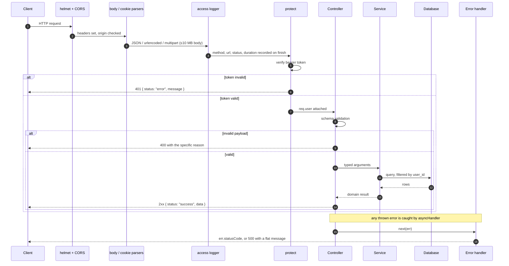
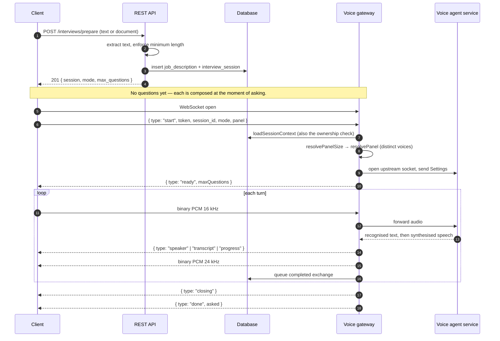
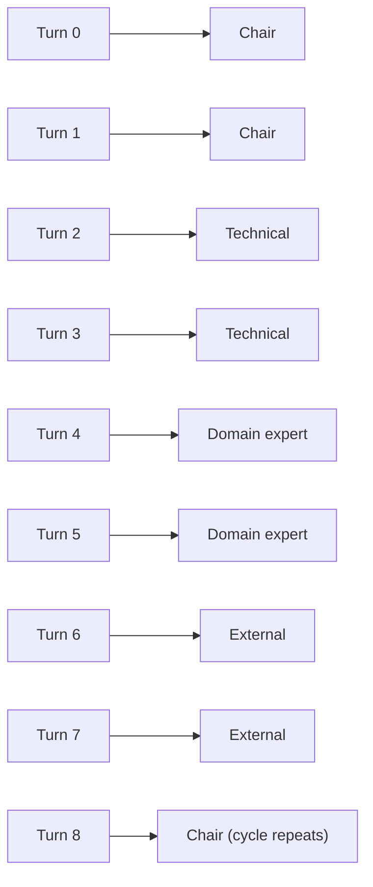
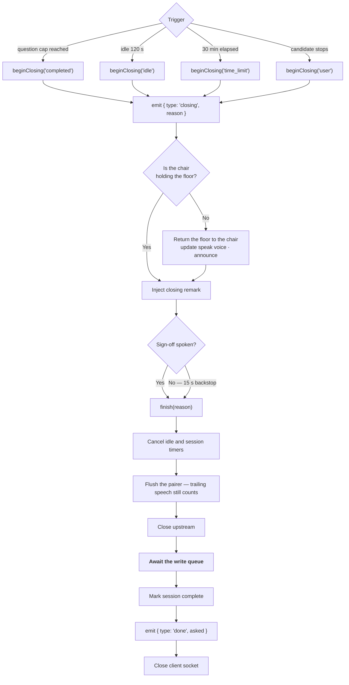
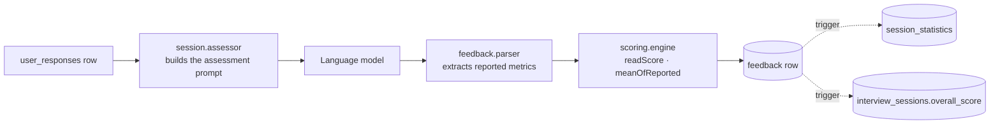
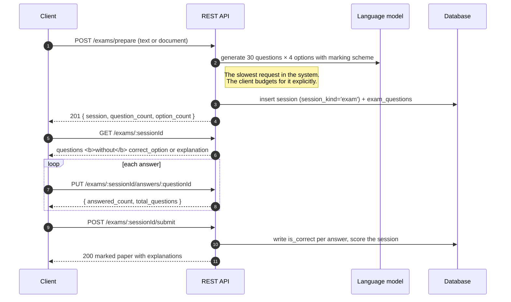
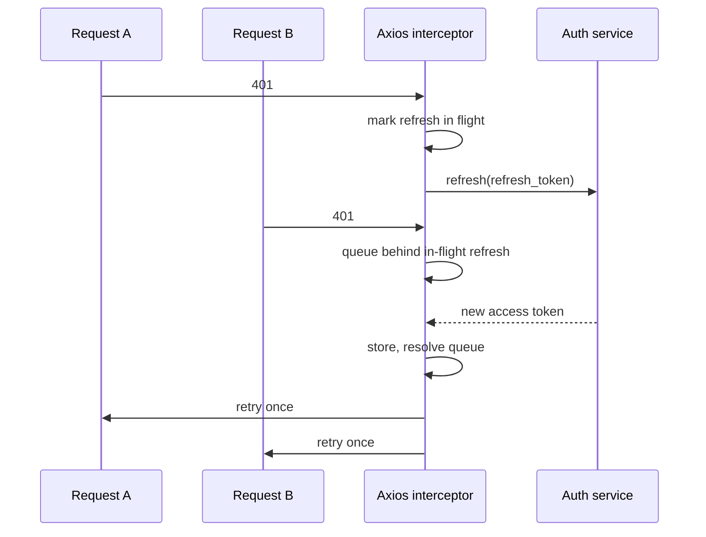

# Chapter Four — Implementation

## 4.1 Introduction

This chapter documents how the design in Chapter Three was realised. §4.2
justifies the technology selections. §4.3 covers backend realisation. §4.4–4.6
treat the three substantive subsystems — live voice, generation and grading,
written examination — in the depth their novelty warrants. §4.7 covers the
client, §4.8 the cross-cutting concerns, and §4.9 reports the implementation
challenges encountered and how each was resolved.

The delivered system comprises **111 backend source files (~16,000 lines of
JavaScript)** and **70 client source files (~13,200 lines of TypeScript)**,
supported by **31 test suites (~8,000 lines)** examined in Chapter Five.

## 4.2 Development Environment and Technology Stack

### 4.2.1 Backend

**Table 4.1 — Backend technology and rationale**

| Concern | Selection | Rationale |
| --- | --- | --- |
| Runtime | Node.js ≥ 20 LTS, ES modules | The system is I/O-bound rather than CPU-bound — it waits on databases, model APIs, and sockets. An event-driven single-threaded runtime suits that profile, and holding hundreds of concurrent idle WebSockets costs almost nothing. |
| HTTP framework | Express 5 | Minimal, unopinionated, and — decisively for this design — exposes the underlying HTTP server object, which is what allows the WebSocket gateway to attach to the same listener (§3.7.2). |
| WebSocket | `ws` | The lowest-level mature option. `noServer` mode gives explicit control of the upgrade handshake, which the path-scoped attachment requires. |
| Database, auth, storage | Supabase (PostgreSQL) | Supplies relational storage, JWT-based authentication, object storage, and row-level security as one managed service. For a single developer, the alternative — running Postgres, implementing authentication, and operating a storage tier — would consume the project's budget on undifferentiated work. |
| Validation | Joi | Schema-first validation at the controller boundary, keeping input assumptions declarative and adjacent to the route rather than scattered through service code. |
| Security middleware | Helmet, CORS, `express-rate-limit` | Standard headers, origin control, and per-address limits on authentication endpoints. The limiters are defined in the auth module beside the routes they protect; §5.8 examines whether their configured ceilings match the threat they were adopted for. |
| File upload | Multer, memory storage | Memory storage is a security requirement, not a convenience: an uploaded curriculum vitae must never reach disk (§4.8.4). |
| Document extraction | `pdf-parse`, `mammoth`, `officeparser`, `word-extractor` | One extractor per format family, behind a single registry (§4.8.3). |
| Logging | Winston + Morgan | Structured application logging with an HTTP access line. |
| Testing | Jest + Supertest, Babel | Serial execution with open-handle detection (§5.2). |

### 4.2.2 Client

**Table 4.2 — Client technology and rationale**

| Concern | Selection | Rationale |
| --- | --- | --- |
| Framework | React Native 0.81 via Expo SDK 54 | One codebase for iOS, Android, and web (NFR-14). Expo's managed native modules cover audio, document picking, file system, printing, and deep linking without ejecting. |
| Language | TypeScript 5.9 | The API contract is expressed as shared types, so a change to a wire shape becomes a compile error rather than a runtime one. |
| Navigation | expo-router | File-based routing keeps the screen map (Figure 3.8) legible from the directory structure. |
| Audio | `react-native-audio-api` | Required for raw PCM capture and playback at specified sample rates; the higher-level recording APIs return encoded files, which a duplex stream cannot use. |
| HTTP | Axios with interceptors | Interceptors are what make transparent token refresh possible without every call site handling 401 (§4.8.1). |
| State | React Context providers | Four cross-cutting concerns — authentication, theme, mode, interviewer selection — are genuinely global; nothing else in the application justified a state-management library. |
| Persistence | AsyncStorage | Token and preference storage. |
| Export | `expo-print`, `expo-sharing` | Renders a tailored CV to PDF for sharing. |

### 4.2.3 A note on the boundary

The stack contains no machine-learning framework. This is the delimitation of
§1.6 expressed in dependencies: inference is consumed over HTTP and WebSocket
from managed services, and every line of code in this project concerns the
domain rather than the models. §6.4 records the dependency risk this accepts.

## 4.3 Backend Implementation

### 4.3.1 Module realisation

**Table 4.3 — Backend modules and owned responsibilities**

| Module | Owns |
| --- | --- |
| `auth` | Identity-provider integration, the `protect` middleware, rate limiters, token refresh, OAuth, email verification, password reset |
| `users` | The authenticated user's own profile, activation flag, account deletion |
| `jobDescription` | Source material — pasted or parsed — with extracted skills and full-text search |
| `interviews` | Session lifecycle, one-shot preparation, per-turn composition, retakes; and the mode, panel, and voice registries |
| `exams` | Paper generation, sitting, arithmetic marking, retakes |
| `questions` | Bulk question generation outside the live loop |
| `responses` | Candidate answers and per-session completion statistics |
| `feedback` | Grading, the pure scoring engine, session assessment and summaries |
| `history` | Reviewable sessions, notes, archiving, aggregate statistics |
| `cv` | Curriculum-vitae tailoring against a session's job description |
| `speech` | Asynchronous transcription, synthesis, voice and format catalogues |
| `agent` | The live voice session: gateway, per-session state machine, prompt assembly, transcript pairing |
| `ai` | Provider-facing generation, prompt templates, response parsing |
| `uploads` | Document text extraction across all accepted formats |

Every module implements the five-file anatomy of §3.7.4. The uniformity is a
maintainability requirement (NFR-15), and its practical effect is that locating
any behaviour requires knowing only the module and the kind of concern.

### 4.3.2 The request lifecycle

**Figure 4.1 — HTTP request lifecycle**



### 4.3.3 Error handling policy

The global handler applies one rule, and it is worth stating because it governs
every user-facing message in the system.

An error that named its own status code said something deliberate about what the
client should do, so its message is passed through unchanged. An error arriving
without a status is a fault nobody anticipated, and its message is therefore an
internal detail: it becomes one flat line to the client and the real text goes
to the log.

The rule was adopted after a candidate was shown *"JWT issued at future"* —
the identity provider's response to two of its own machines differing by a
second. The message is simultaneously incomprehensible to a user and a
disclosure of internal architecture. Under the current policy it is logged and
the user is told the session could not be verified.

### 4.3.4 Route ordering

Express matches routes in registration order, so static segments must be
registered before parametric ones at the same depth. Six concrete collisions
exist in this codebase and are documented rather than left to be rediscovered:

| Registered first | Would otherwise be captured as |
| --- | --- |
| `POST /interviews/prepare` | `:id` |
| `POST /exams/prepare` | `:sessionId` |
| `GET /history/stats` | `:id` |
| `GET /responses/health` | `:id` |
| `GET /responses/sessions/:id/stats` | `:questionId` |
| `GET /cv/sessions/:sessionId` | `:id` |

### 4.3.5 Practice modes

**Table 4.4 — Practice modes and server-side parameters**

| Mode | Format | Persona | Question mix | Panel |
| --- | --- | --- | --- | --- |
| `job_interview` | voice | An experienced hiring manager interviewing for this role | ~40% behavioural, 30% technical, 20% situational, 10% general | 1–4, client's choice |
| `viva_defense` | voice | A doctoral examination panel challenging the author | ~40% technical (methodology, validity), 40% situational (defending choices under challenge), 20% general (contribution, scope) | 1–4, client's choice |
| `visa_interview` | voice | A consular officer at an embassy window | ~50% general (purpose, plans, background), 30% situational (funding, ties, contingencies), 20% technical (specifics) | **Fixed at 1** |
| `exam` | written | A university examiner setting a paper on this material | 30 questions × 4 options | — |

Two properties of this table are enforced rather than advisory.

**A consular interview is one officer at one window**, whatever the client
requests. `resolvePanelSize` consults the mode before the request, so a stale or
hand-rolled client cannot produce a panel of consular officers — which does not
exist and would misrepresent the event being rehearsed. The same function caps
every other mode at four.

**Mode guidance encodes markability, not flavour.** The `visa_interview`
guidance instructs the examiner never to state or imply a decision and never to
give immigration advice — a candidate who leaves a practice session believing
their visa is approved has been actively harmed. The `exam` guidance requires
that exactly one option be defensibly correct, that distractors be wrong on the
subject rather than merely worse, and that no item require a fact the material
never introduces. These are the answerability and distractor-quality criteria of
§2.4.2 expressed as generation constraints.

## 4.4 The Live Voice Subsystem

This subsystem carries the project's principal technical risk and is treated in
proportion. It comprises a gateway (207 lines), a per-session state machine
(467 lines), prompt assembly (186), upstream settings (159), and transcript
pairing (143).

### 4.4.1 End-to-end flow

**Figure 4.2 — Live spoken interview**



Audio is relayed frame by frame in both directions rather than buffered. This is
what makes NFR-01 attainable: the candidate perceives time-to-first-audio, not
time-to-complete-utterance, so a three-second reply begins arriving in
well under a second.

### 4.4.2 Per-turn question composition

`POST /interviews/prepare` creates a session and a source-material record and
returns **no questions at all**. Each question is composed at the moment it is
needed, against the transcript accumulated so far.

The original design generated a full set at preparation and read them out in
order. That produces a questionnaire, not an interview. The thing an interview
actually tests — being asked a follow-up about a claim you made ninety seconds
ago — is unreachable from a pre-written list, because question seven was written
before answer six existed. It also front-loads all cost and latency: the
candidate waits for fifteen questions to be written before hearing the first,
and every question is paid for whether or not the session runs to completion.

Per-turn composition inverts both properties. Each question sees the answers
before it, so follow-ups are possible; and inference is bought only for
questions actually asked. The costs accepted are that per-turn latency now sits
inside the conversational window rather than in a one-off wait, and that the
question set cannot be inspected before the session begins.

Backward compatibility is handled by tolerance rather than rejection: the
preparation validator still *accepts* a `questionCount` field and ignores it, so
an older client's setup request succeeds rather than failing on an unknown
field. Sessions are capped at fifteen questions (`MAX_SESSION_QUESTIONS`) and
run for at most thirty minutes.

Written examinations are the deliberate exception (§4.6): a student sitting a
paper expects a paper of known length that does not change under them. This is
ADR-0004.

### 4.4.3 Panel seating and voice distinctness

A panel whose members share a voice is a panel of one wearing several names.
Two mechanisms produce that failure, and neither requires a hostile client.

A **stale client** may send a voice identifier the catalogue no longer contains.
Voice resolution answers unknown identifiers with the default rather than
throwing, because refusing to seat a panel over a renamed voice is a worse
outcome than seating it — but send two unknowns and both seats collapse onto the
same default. A **hand-rolled client** may simply send the same identifier
twice.

`resolvePanel` therefore treats distinctness as an invariant it enforces, not a
property it trusts. Collisions are resolved **against the catalogue rather than
reported**, preferring a substitute of the same apparent gender so that a
substitution does not silently re-cast a panelist. The reasoning is a comparison
of failure modes: a colleague in an unexpected voice is a far smaller failure
than a colleague who is audibly the chair. Where a client sends no roster at
all — an older build predating panel voices sends a single voice and a size — a
built-in bench of named panelists fills the remaining seats, so those sessions
still produce real names rather than "Interviewer 2".

**Floor rotation** is scheduled server-side in blocks of two turns per speaker
rather than one:

**Figure 4.3 — Floor rotation, four-member panel**



One turn per speaker would make a follow-up impossible: the candidate would hear
a new person pick up a thread they were not part of, which is not how a panel
behaves. Two turns is enough for a question and the follow-up it invites, and
still gets every member of a four-person panel heard within the first eight
questions.

The client is also told who is speaking, by name and role, on every handover.
Voice is the primary identity signal in an audio channel, but reinforcing it
visually mitigates the case where two synthesised voices are less
distinguishable to a particular listener than the catalogue assumes.

### 4.4.4 Ending a session

**Figure 4.4 — Closing sequence**



Three properties of this sequence are deliberate and each was arrived at by
observing the alternative fail.

**Closing is a phase, not an event.** Cutting the socket when the cap is reached
clips the interviewer mid-sentence, and the candidate cannot tell whether the
interview ended or the application broke.

**The chair closes, whoever asked last.** Only the synthesis voice is switched;
the closing text carries its own prompt. An interview closed by whichever
panelist happened to ask question fifteen does not read as an interview.

**The write queue is awaited before completion.** Marking a session complete
while exchanges are still being written means grading runs against a transcript
that is still being written — producing feedback for a session the candidate
remembers differently. The await is the mechanism behind NFR-06.

A 15-second backstop finishes the session regardless of whether the sign-off is
ever spoken. Without it, an injection refused upstream, or audio that never
arrives, leaves the session waiting on a condition that will never be satisfied.

### 4.4.5 Transcript pairing

The most subtle component in the subsystem, and the one most likely to be wrong,
which is why it is implemented as a pure class with no database and no socket
dependency.

The database, the history screen, and the grader all assume one question paired
with one answer. A live conversation does not arrive that way. The upstream
service emits recognised text **per utterance**, so a single spoken answer
routinely arrives as three separate user messages, and the interviewer's
acknowledgement and its actual question arrive as two separate assistant
messages:

```
assistant  "That's a significant improvement."
assistant  "How did you move the sync layer off the main thread?"
user       "Sure. I led the rebuild of our field service app."
user       "It had about forty thousand monthly users,"
user       "and I cut cold start from six seconds to under two."
```

Writing a row per message produces five fragments where the grader expects one
exchange. `TranscriptPairer` therefore joins consecutive messages from the same
speaker into a turn, and emits a completed exchange only when the speaker
changes back — the point at which both halves are known to be whole.

One case required separate handling and is instructive about the class of bug
this component exists to prevent. Candidates frequently speak before anything
has been asked — "hello, can you hear me?" over the greeting. Accumulating that
into the pending answer would pair it with the interviewer's *first sentence*,
which on a two-sentence turn is the acknowledgement rather than the question,
producing a persisted exchange that never happened. Pre-question speech is
therefore held separately and carried forward into the first real answer,
because discarding what a candidate said is never the safer default.

## 4.5 The Generation and Grading Subsystem

### 4.5.1 Prompt construction

Prompts are assembled server-side from the mode registry (§4.3.5) — persona,
source label, question-type mix, and mode-specific guidance — and combined with
the source material and, for composition, the transcript so far. No part of a
prompt originates on the client. This is a security property as much as a design
one: the persona and the rules that make a question markable are precisely what
must not be visible to the person being examined.

### 4.5.2 The grading pipeline

**Figure 4.5 — Grading pipeline**



Five dimensions are assessed, each 0–100: relevance, completeness, technical
accuracy, clarity, and confidence. Each response additionally receives
`strengths` and `improvements` arrays and a narrative summary — the task- and
process-level feedback that §2.2.2 identifies as the effective kind.

### 4.5.3 The scoring engine: null is not zero

The scoring engine is pure — no database, no HTTP framework, no model client —
so its rules can be exercised exhaustively in isolation (NFR-16). Its central
rule answers RQ3.

`technical_accuracy_score` is optional in the assessment schema, and a grader
reading a behavioural answer routinely omits it. Recording that omission as 0
asserts that the candidate scored nothing on technical accuracy, and drags a
five-metric average down by a fifth over a question that was never technical.
The candidate then sees a depressed score for a reason that does not exist and
cannot be acted on — feedback at Hattie and Timperley's least effective level,
arrived at by an arithmetic accident.

The engine therefore distinguishes three states where a naïve implementation has
two, and enforces the distinction at every stage:

| Function | Contract |
| --- | --- |
| `clampScore(v, fallback)` | Coerces any numeric-ish value into a 0–100 integer; non-numeric falls back |
| `readScore(v)` | **Never invents a number.** `null`, `undefined`, `''`, and unparseable text all return `null` — a plain `Number()` would turn the first three into 0, which is exactly the confusion this function exists to prevent |
| `meanOfReported(values)` | Averages only non-null values; returns `null` when none were reported |
| `deriveOverallScore(scores, provided)` | Trusts the model's holistic judgement where given, since it can weigh a technically thin but highly relevant behavioural answer better than a fixed formula; falls back to the mean of reported sub-scores |
| `normalizeFeedback(raw)` | Throws only if the payload is structurally unusable; an individual unreadable metric becomes `null` rather than failing the response, since a hard failure would cost an entire session's feedback over one malformed field |
| `computeSessionAggregate(rows)` | Averages each dimension over only the rows that reported it, so one answer graded without a technical score does not pull the session's technical average toward zero |

The rule propagates all the way to the interface: a dimension no answer reported
is displayed as *not assessed*, never as zero. This is ADR-0007.

### 4.5.4 A schema-evolution compromise

One implementation detail is reported here rather than concealed, because it is
a real compromise and Chapter 6 records it as technical debt.

The `feedback` table was created with four score columns —
relevance, clarity, confidence, completeness — before technical accuracy was
introduced as a fifth dimension. Rather than requiring every deployed database
to be migrated in step with the application, the persistence layer packs
`technical_accuracy_score` and the narrative summary into JSON stored in the
existing `suggestions` text column, while the read path prefers a real column
where one exists and falls back to the packed value where one does not:

```js
technical_accuracy_score:
  row?.technical_accuracy_score ?? meta?.technical_accuracy_score ?? null
```

This works, is tested, and made the feature deployable against existing
databases without coordinated downtime. It is nonetheless a typed value stored
untyped, invisible to database constraints and unavailable to SQL aggregation.
The migration that promotes it to a first-class column is identified in §6.5.

## 4.6 The Written Examination Subsystem

**Figure 4.6 — Written examination lifecycle**



Three properties distinguish this subsystem from the spoken one.

**The whole paper is generated at once**, in deliberate contrast to §4.4.2. A
student sitting an examination expects a paper of known length that does not
change under them. The cost is the slowest single request in the system,
comfortably beyond Nielsen's ten-second attention threshold; NFR-03 therefore
requires it to be signposted with determinate progress rather than hidden, and
the client's timeout is set for it explicitly.

**Marking is arithmetic, not model-driven.** The marking scheme was fixed when
the paper was generated; marking compares the selection to it. Re-consulting a
model at marking time would make the same paper markable differently on two
occasions, which is not an examination.

**Correctness is written at marking time**, not derived on read (§3.8.3). The
paper a candidate was marked against is what their result must continue to
report.

Disclosure control is structural. The mapper used while a paper is being sat has
**no field** for the correct option or the explanation; a second mapper adds them
back after marking. Guaranteeing non-disclosure by omitting a field is stronger
than guaranteeing it by deleting one, because forgetting to delete discloses
silently while a missing field is a visible absence.

## 4.7 Client Implementation

### 4.7.1 Structure

```
frontend/
├── app/          File-based routes: auth group, tab group, session flow, settings
├── components/   Shared presentational components
├── constants/    Modes, interviewer roster, theme, upload rules
├── hooks/        Context providers and custom hooks
├── lib/          API client, token storage, formatting, PDF export, session events
├── services/     Typed wrapper per API module
└── types/        Shared contracts
```

The `services/` layer mirrors the backend's module decomposition one-to-one, so
that a change to an endpoint has exactly one client-side site to update.

### 4.7.2 The voice session hook

`use-agent-session.ts` encapsulates the client half of the protocol in §3.10:
opening the socket, sending the `start` frame, capturing microphone audio as
16 kHz PCM, playing 24 kHz PCM as it arrives, and surfacing speaker, transcript,
and progress events as React state. Screens consume the state; none of them
handle a frame.

A platform constraint is documented rather than worked around: live voice
requires a development build, because raw PCM capture at a specified sample rate
is not available in the standard Expo client. The written examination mode is
fully functional without one, which is what makes NFR-05's degradation path
meaningful rather than theoretical.

### 4.7.3 Development-time host resolution

In development the client derives its API host from the development server it is
already connected to, rather than trusting a configured address. The
configured value supplies the port and path only. The reason is concrete: a
laptop's LAN address changes when the network hands out a new lease, and a stale
configured address fails as a network error or — worse, on the socket path — as
an interviewer that simply never speaks. Deriving the host from a connection
that is by definition current removes an entire class of "it worked yesterday"
failure. The socket URL is in turn derived from the REST base URL, so one
correction fixes both.

## 4.8 Cross-Cutting Implementation Concerns

### 4.8.1 Transparent token refresh

**Figure 4.7 — Token refresh with request queueing**



Three rules govern this, each addressing a failure observed during development.

**One refresh, not one per request.** Without queueing, five concurrent requests
on a dashboard produce five simultaneous refreshes, of which four use a token
the first has already rotated — and the user is signed out in the middle of
using the application.

**Authentication endpoints are excluded.** There is no useful refresh flow when
the refresh itself is what failed; retrying it produces an infinite loop.

**A network failure does not sign the user out.** A refresh that fails because
the device is briefly offline is not a refusal, and wiping credentials for a
lost connection is a worse outcome than a failed request. Only an explicit
rejection clears the session.

### 4.8.2 Retry and idempotency

The system relies on external services with real failure rates, and its
retry policy is deliberately narrow. Read-only operations retry with backoff.
Generation operations do not retry automatically, because a partially completed
generation retried blindly can produce duplicate persisted rows; the client
surfaces a failure and offers an explicit retry the user chooses. Persistence of
transcript exchanges is queued and awaited (§4.4.4) rather than retried, since
ordering matters more than throughput on that path.

### 4.8.3 Document ingestion

**Table 4.5 — Accepted formats**

| Family | Extensions | Extractor |
| --- | --- | --- |
| Portable documents | `.pdf` | `pdf-parse` |
| Word processing | `.docx`, `.odt`, `.rtf` | `mammoth`, `officeparser` |
| Legacy Word | `.doc` | `word-extractor` |
| Presentations | `.pptx`, `.odp` | `officeparser` |
| Spreadsheets | `.xlsx`, `.ods` | `officeparser` |
| Plain text | `.txt`, `.md`, `.csv` | Direct read |

Two implementation decisions carry more weight than they appear to.

**One registry, read by both ends of the same journey.** The upload filter that
decides whether to accept bytes and the parser that decides which extractor to
run consult the same table. Split across two files they drifted, and the
observable symptom was a file the server would happily parse that could not be
selected in the picker.

**Extension is the primary key, not MIME type.** Mobile uploads frequently carry
`application/octet-stream`; some Android document providers report no type at
all, and the client supplies a placeholder so the multipart body is well-formed.
The filename survives that trip intact, and is therefore the more reliable
signal. Legacy binary `.ppt` and `.xls` are named explicitly as unsupported so
that a student who picks one is told to re-save it rather than shown a generic
list of what was allowed.

No file-size ceiling is imposed. A slide deck carrying its images is several
times the size of the text it yields, and rejecting it on total bytes would
reject material the system can process perfectly well.

### 4.8.4 Non-persistence of sensitive material

Curriculum-vitae text is the most sensitive material the system touches. A CV
assembles employment history, home address, telephone number, and frequently
date of birth and nationality into one document — the concentration is precisely
what makes it valuable to an attacker and damaging to leak.

The obvious implementation stores the extracted text: it would make regeneration
cheaper, support easier, and future features — comparing two tailorings,
re-running against a different model — straightforward. The implementation
instead holds the text in memory for the duration of the request and discards
it. The uploaded file is never written to disk, because uploads use memory
storage. The persisted record retains the rewritten document, the source
filename for display, and the source character count for support diagnostics.

The functionality forfeited is real and was weighed. What was concluded is that
the safest way to hold this particular material is not to hold it: text that was
never stored cannot be disclosed by a misconfigured bucket, an over-broad query,
or a backup restored to the wrong place. This is ADR-0005 and answers RQ5.

### 4.8.5 Voice indirection

The client names each panelist by a stable voice identifier such as `f_warm_01`;
the server resolves that identifier to an actual synthesis voice. The roster is
a product decision, the voice catalogue a vendor detail, and separating them
means a vendor change touches one server file.

This was not hypothetical. Migrating the synthesis provider changed exactly one
file and required no client release — which, for a mobile application subject to
store review, is the difference between a same-day change and a week (ADR-0006).

### 4.8.6 Operational concerns

Logging records the HTTP access line plus method, URL, status, and duration on
response completion, through a structured logger. Stack traces appear in
responses only in development. `SIGTERM` and `SIGINT` close the HTTP server and
exit, with a ten-second forced shutdown as a backstop; uncaught exceptions and
unhandled rejections are logged and follow the same path.

## 4.9 Implementation Challenges and Resolutions

**Table 4.6 — Challenges and resolutions**

| # | Challenge | Resolution | Where |
| --- | --- | --- | --- |
| 1 | Conversational latency budget: recognition, composition, and synthesis must fit between utterances | Relay audio frame by frame in both directions so the candidate perceives time-to-first-audio, not time-to-completion | §4.4.1 |
| 2 | Recognised text arrives per utterance, not per turn — five fragments where the grader expects one exchange | Pure `TranscriptPairer` joining consecutive same-speaker messages, emitting only on speaker change | §4.4.5 |
| 3 | Candidate speech before the first question pairs with the interviewer's acknowledgement, persisting an exchange that never occurred | Pre-question speech held separately and carried into the first real answer rather than discarded | §4.4.5 |
| 4 | Panel members collapsing onto one voice through unknown or duplicate identifiers | Distinctness enforced server-side against the catalogue, preferring a same-gender substitute | §4.4.3 |
| 5 | Cutting the socket at the question cap clips the interviewer mid-sentence | Closing made a phase: chair regains the floor, delivers a sign-off, 15 s backstop guarantees termination | §4.4.4 |
| 6 | Grading running against a transcript still being written | Session completion awaits the write queue | §4.4.4 |
| 7 | Unreported grading dimensions depressing averages as zeros | `readScore`/`meanOfReported`: null propagated end to end, excluded from every average, displayed as *not assessed* | §4.5.3 |
| 8 | Fifth grading dimension added after the table was created | Packed into existing JSON-bearing column with a column-preferring read path; recorded as technical debt | §4.5.4 |
| 9 | Concurrent 401s producing simultaneous refreshes and spurious sign-out | Single in-flight refresh with request queueing; network failures do not clear the session | §4.8.1 |
| 10 | Mobile uploads arriving with absent or placeholder MIME types | Extension as primary key; one registry shared by filter and parser | §4.8.3 |
| 11 | Development host addresses going stale on lease renewal, failing opaquely | Host derived from the live development-server connection; socket URL derived from the REST base | §4.7.3 |
| 12 | Internal identity-provider errors surfacing to users as incomprehensible text | Status-bearing errors pass through; statusless faults are flattened and logged | §4.3.3 |

---

**Previous:** [Chapter Three](03-methodology.md) · **Next:** [Chapter Five — Testing, Results and Evaluation](05-testing-and-evaluation.md)
