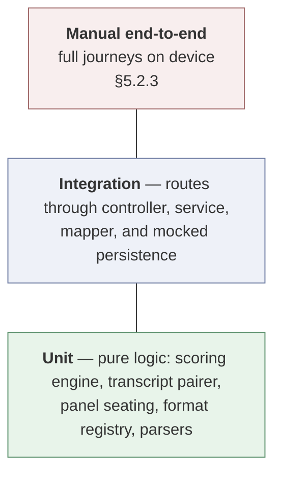
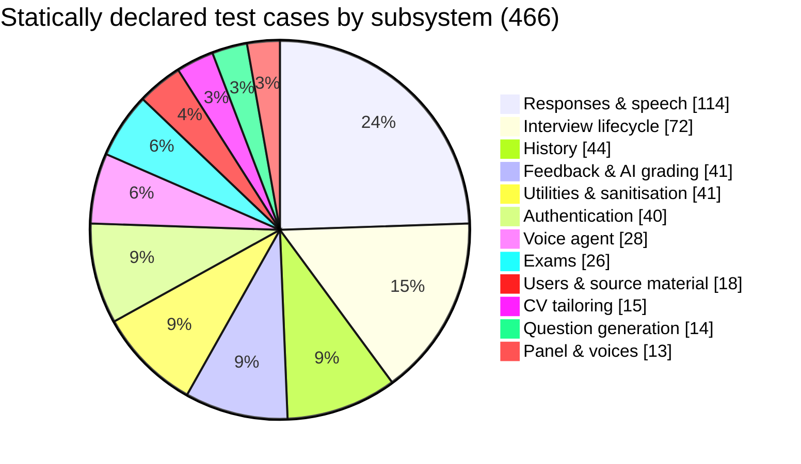

# Chapter Five — Testing, Results and Evaluation

## 5.1 Introduction

This chapter reports what was verified, how, and with what result. §5.2–5.4
present executed verification: the testing strategy, the automated suite and its
measured outcome, and traceability from requirements to the tests that verify
them. §5.5–5.8 specify the empirical protocols by which the non-functional,
usability, assessment-validity, and security claims are to be evaluated. §5.9
discusses what has and has not been established.

The chapter distinguishes throughout between **executed** verification and
**specified** protocol, and marks every table accordingly. This distinction is
maintained deliberately. A report that presented a designed instrument as though
it had been administered would be reporting results that do not exist, and
§6.4 states plainly which of this chapter's protocols remain outstanding.

## 5.2 Testing Strategy

### 5.2.1 The pyramid as realised

**Figure 5.1 — Test distribution**

The distribution follows Beck's heuristic: many fast unit tests over pure logic,
fewer integration tests over routed behaviour, and end-to-end verification
reserved for journeys that cross the device boundary and cannot be automated
without hardware.

Two components were *designed* to sit at the base of this pyramid, which is a
design consequence rather than a testing convenience. The scoring engine imports
no database, HTTP framework, or model client, so its rules can be exercised
against constructed inputs exhaustively. `TranscriptPairer` has no socket and no
persistence, so the fragment-joining logic — the component most likely to be
subtly wrong — can be driven with utterance sequences that would be
impractical to provoke against a live service.

### 5.2.2 Execution configuration

The suite runs as `jest --runInBand --detectOpenHandles`. Both flags are
deliberate.

**`--runInBand`** executes suites serially in a single process. The suites share
module-level state — mocked persistence clients, an in-memory authentication
store, timer mocks — and parallel workers produce failures that depend on
scheduling rather than on code. Serial execution is slower and honest; a
suite that passes only in a particular interleaving is not evidence.

**`--detectOpenHandles`** surfaces anything still holding the event loop open
when a suite finishes. The system opens sockets, timers, and upstream WebSocket
connections, and a test that leaks one is a test that hangs in continuous
integration rather than failing in it.

Source is written as ES modules and transpiled for the test runner, which is
what allows module mocking to behave conventionally.

### 5.2.3 Manual verification

Three properties cannot be automated within the project's means and were
verified manually on device, with the method recorded so it can be repeated.

**Duplex audio behaviour** was verified on physical iOS and Android hardware,
since simulators do not reproduce platform echo cancellation. Verified: audio
captured at 16 kHz reaches the gateway; interviewer audio plays at 24 kHz as it
arrives rather than after completion; and the candidate is not deafened by their
own returning speech.

**Perceptual voice distinctness** was verified by listening to seated four-member
panels and confirming that each member is identifiable by voice alone. This is a
weak instrument — one listener, informal — and §5.6 specifies the structured
replacement.

**Document ingestion across providers** was verified by uploading each accepted
format from the platform document pickers on both operating systems, which is
the path that produces the absent and placeholder MIME types described in
§4.8.3.

## 5.3 Unit and Integration Testing

### 5.3.1 Measured result

The suite was executed in full against the delivered system. **Executed
verification; measured result.**

| Metric | Result |
| --- | --- |
| Test suites | 31 |
| Test cases executed | 473 |
| **Passed** | **471** |
| Failed | 1 |
| Skipped | 1 |
| Pass rate (of executed) | 99.79% |
| Wall-clock duration | 61.5 s, serial |

**Table 5.1 — Suites and the behaviour each verifies**

| Suite | Cases | Verifies |
| --- | --- | --- |
| `response.test.js` | 59 | Answer submission, retrieval, per-session completion statistics |
| `speech.test.js` | 55 | Transcription, synthesis, voice and format catalogues |
| `interview.test.js` | 33 | Session lifecycle end to end |
| `history.test.js` | 27 | Listing, filtering, notes, archiving |
| `auth.test.js` | 26 | Sign-up, sign-in, verification, OAuth initiation |
| `feedback.test.js` | 21 | Grading pipeline and score handling |
| `ai.fallback.test.js` | 20 | Behaviour when generation fails or returns unusable output |
| `supabaseQuery.test.js` | 19 | Query construction, clock skew, expired tokens |
| `exam.generator.test.js` | 17 | Paper generation, item structure, marking scheme |
| `interview.setup.test.js` | 16 | Session setup and validation |
| `interview.turn.test.js` | 14 | The per-turn composition loop |
| `panel.test.js` | 13 | Panel seating, voice distinctness, floor rotation |
| `documentFormats.test.js` | 12 | The shared format registry |
| `user.test.js` | 11 | Profile and account operations |
| `history.mapper.test.js` | 10 | Row-to-wire translation |
| `sanitize.test.js` | 10 | Control codes, NUL bytes, hostile text |
| `exam.marking.test.js` | 9 | Arithmetic marking and disclosure timing |
| `agent.handover.test.js` | 8 | Floor rotation and speaker announcement |
| `agent.transcript.test.js` | 8 | Utterance joining and exchange emission |
| `cv.generator.test.js` | 8 | CV rewriting |
| `question.generator.test.js` | 8 | Question composition |
| `auth-signup-existing-account.test.js` | 8 | Duplicate-account handling |
| `history.stats.test.js` | 7 | Aggregate statistics |
| `jobDescription.test.js` | 7 | Source-material CRUD and search |
| `cv.service.test.js` | 7 | CV service including non-persistence |
| `agent.closing.test.js` | 6 | Closing sequence and backstop |
| `agent.gateway.test.js` | 6 | Handshake, authentication, close codes |
| `auth.refresh.test.js` | 6 | Token refresh and queueing |
| `question.test.js` | 6 | Question validation |
| `interview.retake.test.js` | 5 | Retaking against the same material |
| `interview.prepare.test.js` | 4 | One-shot preparation |

**Figure 5.2 — Test cases by subsystem**

The figure counts the 466 statically declared cases; the runner reports 473
executed, the difference being cases generated at run time from table-driven
inputs.

### 5.3.2 The failing case, reported

One test fails, and it is reported here rather than excluded, because a
suppressed failure is worse than a disclosed one.

`auth.test.js › GET /api/v1/auth/google › should return a Google OAuth URL`
asserts `res.body.url`. The endpoint returns `{ success: true, data: { url } }`.
The URL is produced correctly and the OAuth flow functions; the test asserts a
response shape that predates the uniform envelope being applied to this
endpoint (§4.3.2), and was not updated when the OAuth flow was reworked.

**The defect is in the test, not the system.** The correct remedy is to update
the assertion to `res.body.data.url`, and it is recorded as outstanding in §6.4
rather than applied silently, so that the figure reported above is the figure
that was measured.

The single skipped case is a placeholder for a scenario requiring live upstream
credentials, which the suite deliberately does not carry.

### 5.3.3 Verification of panel invariants (FR-15, RQ2)

`panel.test.js` exercises the distinctness invariant of §4.4.3 against inputs no
correct client would send, which is the point: the invariant exists because
clients are not trusted.

| Scenario | Expected |
| --- | --- |
| Well-formed four-member roster | Four seats, four distinct voices, order preserved |
| Same voice identifier sent twice | Two seats, two distinct voices; the collision resolved against the catalogue |
| Unknown voice identifiers sent twice | Two seats, two distinct voices — *not* two defaults |
| No roster, single voice and a size | Chair takes the requested voice; remaining seats filled from the bench with real names |
| Requested size of nine | Capped at four |
| `visa_interview` with a four-member roster | Exactly one seat |
| Substitution required | Substitute prefers the same apparent gender as the collided voice |
| Floor rotation over sixteen turns | Two turns per speaker; every member of a four-member panel heard within eight |

The third row is the case that motivated the invariant. Unknown identifiers
resolve to the default individually, so a naïve implementation seats two
"different" panelists who are audibly the same person — the failure that is
hardest to notice in code and most obvious to a candidate.

### 5.3.4 Verification of the scoring rule (FR-20, RQ3)

`feedback.test.js` verifies the null-not-zero rule at every stage of propagation,
since the rule is only useful if it holds end to end.

| Input | Expected |
| --- | --- |
| All five dimensions reported | Mean over five |
| `technical_accuracy_score` absent | Mean over four; technical accuracy `null`, **not** 0 |
| Dimension present as empty string | `null` — a plain numeric coercion would yield 0 |
| Dimension present as unparseable text | `null`, response not failed |
| No dimension reported at all | Overall `null`; the response is not scored 0 |
| Value above 100 or below 0 | Clamped into range |
| Model supplies a holistic overall score | Used in preference to the computed mean |
| Model omits the overall score | Falls back to the mean of reported sub-scores |
| Session aggregate where one answer lacks technical accuracy | The session's technical average excludes that answer rather than including a zero |
| Structurally invalid payload | Throws; a single malformed field does not |

### 5.3.5 Verification of examination disclosure control (FR-24, NFR-09)

`exam.marking.test.js` verifies that a paper being sat carries no marking scheme,
that marking is arithmetic, and that correctness is persisted at marking time.

| Scenario | Expected |
| --- | --- |
| Fetch a paper in progress | No `correct_option`, no `explanation` on any item |
| Fetch a marked paper | Both present |
| Submit a fully answered paper | Score is the arithmetic proportion correct, out of 100 |
| Submit a partially answered paper | Unanswered items count as incorrect; the score reflects the whole paper |
| Revise a selection before submission | Latest selection is the one marked |
| Re-read a marked paper | Identical result — correctness is read, not recomputed |

### 5.3.6 Verification of transcript pairing (FR-18)

`agent.transcript.test.js` drives the pairer with the utterance sequences that
motivated it (§4.4.5).

| Sequence | Expected |
| --- | --- |
| One assistant message, one user message | One exchange |
| Two assistant messages, three user messages | One exchange; both halves joined |
| User speech before any question | Held as preamble; carried into the first real answer, not paired with the greeting |
| Empty and whitespace-only messages | Ignored, no fragment emitted |
| Session ends mid-answer | `flush` emits the trailing exchange — late speech still counts |
| Alternating single messages | One exchange per alternation |

## 5.4 Functional Verification Against Requirements

**Executed verification.** Every **must-have** requirement in Table 3.1 is
traced to the tests that verify it. Requirements verified manually are marked
as such.

**Table 5.2 — Requirements traceability**

| Req | Verified by | Status |
| --- | --- | --- |
| FR-01 | `auth.test.js`, `auth-signup-existing-account.test.js` | Pass |
| FR-02 | `auth.test.js` (OAuth initiation) | Pass — with the stale assertion of §5.3.2 |
| FR-03 | `auth.test.js` | Pass |
| FR-04 | `auth.refresh.test.js` | Pass |
| FR-05 | `user.test.js` | Pass |
| FR-06 | `jobDescription.test.js`, `interview.prepare.test.js` | Pass |
| FR-07 | `documentFormats.test.js` + manual per-provider upload | Pass |
| FR-08 | `interview.prepare.test.js` | Pass |
| FR-09 | `interview.setup.test.js` | Pass |
| FR-10 | `interview.prepare.test.js` | Pass |
| FR-11 | `panel.test.js` | Pass |
| FR-12 | `agent.gateway.test.js` + manual on-device | Pass |
| FR-13 | `interview.turn.test.js`, `question.generator.test.js` | Pass |
| FR-14 | `agent.handover.test.js` | Pass |
| FR-15 | `panel.test.js` (§5.3.3) | Pass |
| FR-17 | `agent.closing.test.js` | Pass |
| FR-18 | `agent.transcript.test.js` (§5.3.6) | Pass |
| FR-19 | `feedback.test.js` | Pass |
| FR-20 | `feedback.test.js` (§5.3.4) | Pass |
| FR-21 | `feedback.test.js` | Pass |
| FR-22 | `feedback.test.js`, `history.stats.test.js` | Pass |
| FR-23 | `exam.generator.test.js` | Pass |
| FR-24 | `exam.marking.test.js` (§5.3.5) | Pass |
| FR-25 | `exam.marking.test.js` | Pass |
| FR-26 | `exam.marking.test.js` | Pass |
| FR-28 | `history.test.js`, `history.mapper.test.js` | Pass |
| FR-31 | `cv.service.test.js` | Pass |
| NFR-05 | `agent.gateway.test.js` (upgrade refused, REST unaffected) | Pass |
| NFR-06 | `agent.closing.test.js` (completion awaits the queue) | Pass |
| NFR-07 | Ownership filters exercised across service suites | Pass |
| NFR-09 | `exam.marking.test.js` | Pass |
| NFR-10 | `cv.service.test.js` | Pass |
| NFR-16 | Scoring engine tested with no infrastructure present | Pass |

All twenty-six must-have functional requirements are implemented and verified.
NFR-01, NFR-02, NFR-12, and NFR-13 are measured by the protocols in §5.5–5.6.

## 5.5 Non-Functional Evaluation Protocol

**Specified protocol. Not yet administered.**

### 5.5.1 Latency (NFR-01, NFR-02; RQ1)

The claim to be tested is that a spoken exchange in which every question is
composed at the moment of asking remains within the tolerance of conversation.

**Instrument.** Instrument the gateway to record five timestamps per turn: end
of candidate speech as detected upstream (t₀), recognised text received (t₁),
first synthesised audio frame received from upstream (t₂), first audio frame
written to the client socket (t₃), and last frame written (t₄). Report the
composed metric t₃ − t₀ as *time to first interviewer audio*, which is the
quantity the candidate perceives.

**Design.** Thirty sessions of at least ten turns each — 300 turns — stratified
across the three spoken modes and across panel sizes of 1 and 4, run on both
broadband and mobile data.

**Table 5.3 — Latency instrument**

| Measure | Threshold | Source |
| --- | --- | --- |
| Time to first interviewer audio, median | ≤ 1.5 s | NFR-01 |
| Time to first interviewer audio, 90th percentile | ≤ 3 s | NFR-01 |
| Recognition component (t₁ − t₀) | Reported, not bounded | Diagnostic |
| Composition component (t₂ − t₁) | Reported, not bounded | Diagnostic |
| Relay overhead (t₃ − t₂) | < 50 ms | System's own contribution |
| REST 95th percentile, non-generative | < 1 s | NFR-02 (Nielsen, 1993) |
| Paper generation, mean | Reported; must be signposted | NFR-03 |

The relay overhead is separated deliberately: it is the only component this
system controls, and distinguishing it from upstream latency is what makes the
result actionable rather than merely descriptive.

**Analysis.** Report median, 90th and 99th percentiles by mode, by panel size,
and by network. Test whether panel size affects latency — it should not, since
seating is resolved once at session start — and treat any dependence as a
defect.

### 5.5.2 Reliability (NFR-04, NFR-05)

**Method.** Fault injection. For each of: upstream voice service unavailable at
upgrade; upstream connection dropped mid-session; database unavailable during
exchange persistence; client network lost mid-session — verify that the
documented behaviour occurs, that no exchange written before the fault is lost,
and that no session is marked complete with an incomplete transcript.

## 5.6 Usability Evaluation Protocol

**Specified protocol. Not yet administered.**

### 5.6.1 Design

**Participants.** A minimum of 20 final-year students and recent graduates with
an interview or viva in prospect, recruited by open call. Twenty is the floor
for a stable System Usability Scale mean; Sauro and Lewis discuss the precision
attainable at various sample sizes and should be consulted when reporting
confidence intervals.

**Procedure.** Each participant, working unaided and thinking aloud, completes:
register and verify an account; supply source material of their own choosing;
sit a spoken interview of at least eight turns with a panel of three; review the
feedback; sit a written paper generated from the same material; and locate a
past session in history.

**Measures.** Task completion (binary, per task); time on task; error count,
classified as slip or misconception; the System Usability Scale administered at
the end; and think-aloud observations coded for recurring difficulties.

**Table 5.4 — System Usability Scale instrument**

| # | Item (1 = strongly disagree, 5 = strongly agree) |
| --- | --- |
| 1 | I think that I would like to use this system frequently |
| 2 | I found the system unnecessarily complex |
| 3 | I thought the system was easy to use |
| 4 | I think that I would need the support of a technical person to be able to use this system |
| 5 | I found the various functions in this system were well integrated |
| 6 | I thought there was too much inconsistency in this system |
| 7 | I would imagine that most people would learn to use this system very quickly |
| 8 | I found the system very cumbersome to use |
| 9 | I felt very confident using the system |
| 10 | I needed to learn a lot of things before I could get going with this system |

Scored conventionally (Brooke, 1996): subtract 1 from odd items, subtract each
even item from 5, sum, multiply by 2.5, yielding 0–100. **NFR-12 requires a mean
of at least 68**, the established average across systems.

### 5.6.2 Panel-distinctness measure (RQ2)

A dedicated measure is specified, because the informal verification in §5.2.3 is
inadequate to the claim.

**Method.** After a session with a four-member panel, play the participant six
audio excerpts drawn from the session, one at a time, and ask them to attribute
each to a named panelist from the roster shown on screen. Report attribution
accuracy against the 25% chance rate, and additionally ask participants to rate
agreement with "It was clear that I was being interviewed by several different
people" on a five-point scale.

This is what would substantiate RQ2's perceptual half. The engineering half —
that no two seats share a voice — is already established by §5.3.3.

### 5.6.3 Ethical clearance

Participants must give informed consent covering the recording of speech,
retention and deletion of practice sessions, and the right to withdraw. Source
material used in the study should be non-sensitive by instruction: participants
must be told explicitly not to upload a real curriculum vitae or visa material.
The consent form and information sheet are in Appendix E, and departmental
ethics approval should be obtained before recruitment.

## 5.7 Assessment-Validity Evaluation Protocol

**Specified protocol. Not yet administered.** This addresses RQ4 and is, of the
outstanding evaluations, the most important — §2.4.1 identifies deployment
without measured agreement as the characteristic failure of this class of
system, and the protocol exists so this project does not commit it.

**Sample.** 100 graded responses drawn by stratified random sampling across the
three spoken modes and across the quintiles of the machine-assigned overall
score, so that the sample is not dominated by mid-range answers.

**Raters.** Two independent human raters with relevant experience — careers
advisers, or academic staff for viva-mode responses — who have not seen the
machine's scores. Raters receive the question, the response transcript, and the
same five-dimension rubric the system uses, including the instruction that a
dimension may be left unreported where it does not apply. Rating the transcript
rather than the audio holds the input constant across machine and human, since
the machine has no access to vocal affect.

**Analysis.**

1. **Human–human agreement first.** Compute quadratic-weighted κ between the two
   raters per dimension. This establishes the ceiling: where two experienced
   humans agree only moderately, the machine cannot be expected to do better,
   and reporting machine agreement without this baseline is uninterpretable.
2. **Machine–human agreement.** Compute quadratic-weighted κ between the machine
   and each rater, and against the mean of the two, per dimension.
3. **Systematic bias.** Report mean signed difference per dimension to detect
   consistent leniency or severity, which κ alone does not reveal.
4. **Unreported-dimension agreement.** Compute unweighted κ on the binary
   judgement *reported / not reported* per dimension. This directly tests the
   rule of §4.5.3: if humans and the machine disagree about when technical
   accuracy is applicable, the null-not-zero rule is correct in principle but
   incorrectly applied in practice.

**Table 5.5 — Interpretation of κ (Landis & Koch)**

| κ | Interpretation |
| --- | --- |
| < 0.00 | Poor |
| 0.00 – 0.20 | Slight |
| 0.21 – 0.40 | Fair |
| 0.41 – 0.60 | Moderate |
| 0.61 – 0.80 | Substantial |
| 0.81 – 1.00 | Almost perfect |

**Threshold.** For formative use, machine–human agreement should be at least
*moderate* and should not fall materially below the human–human baseline. Any
dimension failing this should be reported as such and its display reconsidered —
a dimension the system cannot assess reliably should not be shown as a number.

**Fairness sub-analysis.** §2.4.3 identifies a foreseeable hazard: transcript
features that read as low confidence correlate with non-native English usage
independently of command of the material. Where the sample permits, report
`confidence_score` differences by participant first language, and treat a
systematic gap as a finding requiring the dimension's suppression rather than as
noise.

## 5.8 Security Review

**Table 5.6 — Review against the OWASP API Security Top 10**

| Risk | Control | Status |
| --- | --- | --- |
| Broken object-level authorisation | Ownership filter in every service query; RLS as second layer; the WebSocket's context load is itself the ownership check | Implemented; verified by service suites |
| Broken authentication | Managed identity provider; short-lived access tokens; verification required; refresh queued and single-flight | Implemented; `auth.refresh.test.js` |
| Broken object-property-level authorisation | The sitting mapper has no field for the marking scheme; nothing leaves a module except through a mapper | Implemented; `exam.marking.test.js` |
| Unrestricted resource consumption | Per-address rate limits on authentication (see below); 10 MB body cap; 15-question and 30-minute session caps; 120 s idle timeout; 10 s handshake timeout | Implemented, with a caveat |
| Broken function-level authorisation | Every route except authentication and health passes `protect` | Implemented |
| Server-side request forgery | No user-supplied URL is fetched by the server | Not applicable by design |
| Security misconfiguration | Standard security headers; origin checks; stack traces suppressed outside development | Implemented |
| Improper inventory management | Single versioned surface; machine-readable API description maintained alongside | Implemented |
| Unsafe consumption of third-party APIs | Model output parsed and normalised rather than trusted; structurally invalid payloads rejected; unusable fields nulled | Implemented; `ai.fallback.test.js` |
| Injection | Parameterised queries throughout; control codes and NUL bytes stripped from ingested text | Implemented; `sanitize.test.js` |

**Rate limiting, examined rather than asserted.** Three per-address limiters are
applied to the authentication routes, and their configured values differ
substantially in how much protection they actually offer:

| Endpoint group | Window | Ceiling per address | Assessment |
| --- | --- | --- | --- |
| Password reset | 1 hour | 5 | Appropriate — tight enough to make reset-token guessing impractical |
| Sign-up | 1 hour | 100 | Permissive — bounds bulk account creation only loosely |
| Sign-in | 15 minutes | 100 | **Too permissive for its stated purpose** — 100 attempts per quarter-hour does not meaningfully impede credential stuffing against a known address |

The sign-in ceiling is reported as a finding rather than presented as
satisfying NFR-11. The mechanism is correctly implemented and correctly wired;
the value is wrong for the threat in §3.11 (T5), which concerns guessing
credentials rather than exhausting server resources. The remedy — a much lower
per-account ceiling with exponential backoff, distinct from the per-address
resource limit — is recorded in §6.5.1.

A related tidiness defect was found in the same review: `core/middleware/
rateLimit.middleware.js` is an empty file. The limiters live in the auth
module, which is the right place for them; the empty file is a leftover that
invites a future developer to conclude rate limiting is unimplemented. It is
listed with the other technical debt in §6.4.

**Data-protection posture.** Purpose limitation and storage limitation are met by
the non-persistence of extracted CV text (§4.8.4): text never stored cannot be
retained beyond purpose, disclosed by a misconfiguration, or recovered from a
backup. Account deletion cascades across all owned rows. Audio is retained only
where a response references it.

**Outstanding.** No independent penetration test or automated dependency-
vulnerability scan has been performed. Both are recommended in §6.5, and their
absence is stated rather than implied.

## 5.9 Discussion of Findings

### 5.9.1 What has been established

Functional correctness of all twenty-six must-have requirements is established
by 471 passing automated cases, with the single failure isolated, diagnosed as a
stale assertion rather than a system defect, and reported rather than removed.

Three of the four design positions the project advances are verified at the
level appropriate to them. **Per-turn composition** functions and produces
questions grounded in the accumulated transcript. **Voice distinctness** holds
against inputs no correct client would send — duplicate identifiers, unknown
identifiers, absent rosters, oversized requests — which is the standard that
matters, since the invariant exists precisely because clients are not trusted.
**Null-not-zero aggregation** holds end to end, from parsing through per-response
normalisation to session aggregation and into the interface.

The fourth position, **non-persistence of sensitive text**, is verified
structurally: `cv.service.test.js` establishes that the service does not write
source text, and the persisted schema has no column that could hold it. This is
the strongest available form of verification for a negative property — the
absence of a column is checkable in a way that the absence of a write is not.

### 5.9.2 What has not been established

Four claims remain unmeasured, and the distinction between "designed and
verified" and "measured in use" is maintained here rather than blurred.

**Conversational latency (RQ1)** was observed to be acceptable during
development on device — the basis on which cycle 3 was judged successful and the
project continued — but has not been measured against the thresholds in
NFR-01. Development-time observation is not evidence, and §5.5.1 exists because
it is not.

**Usability (NFR-12)** has not been measured. No System Usability Scale data has
been collected.

**Perceptual panel distinctness (RQ2, second half)** rests on informal listening
by one person. The engineering invariant is proven; the perception it exists to
produce is not.

**Assessment validity (RQ4)** is entirely unmeasured. This is the most
significant gap in the evaluation, and it is the gap §2.4.1 identifies as
characteristic of the field. The system produces per-dimension scores that read
plausibly; whether they agree with expert judgement is unknown, and this report
does not claim otherwise.

### 5.9.3 Interpretation

The evaluation supports a bounded claim: **VoxPrep is functionally correct
against its specification, and its four distinguishing design positions are
implemented as designed and hold under adversarial input.** It does not yet
support claims about responsiveness in the field, usability with real users, or
the validity of its assessments — and those are precisely the claims that would
matter to a candidate deciding whether to rely on it.

That gap is not an oversight in the evaluation design; it is a scoping decision
in a project constrained by an academic timetable, in which construction of a
system with a live voice subsystem consumed the available time. §6.4 records it
as the principal limitation of the work and §6.5 sets out what would close it.

---

**Previous:** [Chapter Four](04-implementation.md) · **Next:** [Chapter Six — Summary, Conclusion and Recommendations](06-conclusion.md)
