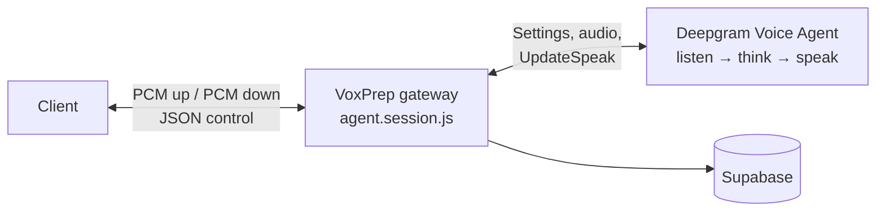
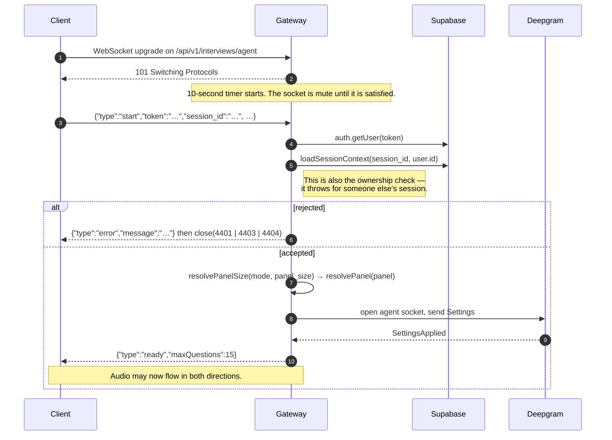
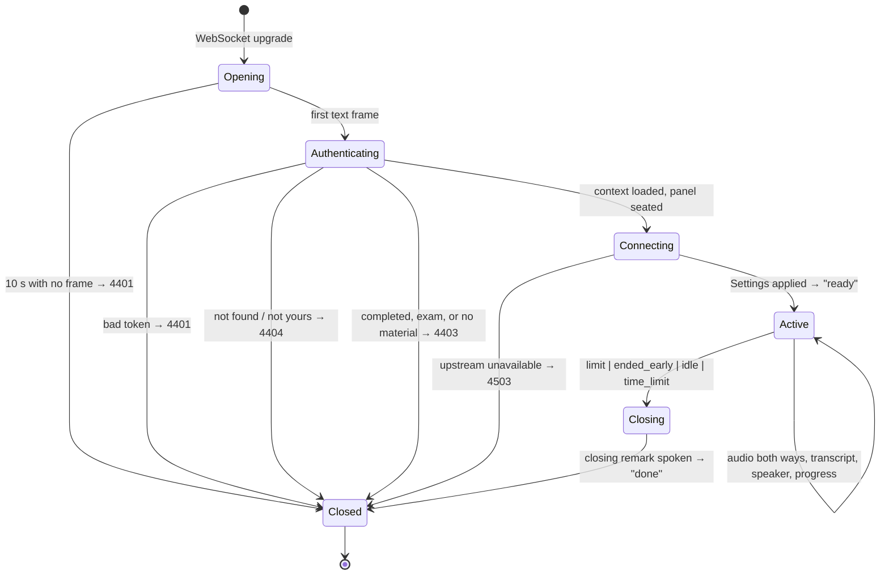

# Voice agent protocol

The wire contract for a live spoken interview. This is a WebSocket, not HTTP —
it is not described in [`api/openapi.yaml`](api/openapi.yaml).

Server: `backend/src/modules/agent/agent.gateway.js` and `agent.session.js`.
Client: `frontend/services/voice-agent.ts`.

## Table of contents

- [Endpoint](#endpoint)
- [Why the shape is what it is](#why-the-shape-is-what-it-is)
- [Handshake](#handshake)
- [Client → server frames](#client--server-frames)
- [Server → client frames](#server--client-frames)
- [Audio formats](#audio-formats)
- [Session lifecycle](#session-lifecycle)
- [Panel and speaker rotation](#panel-and-speaker-rotation)
- [Timeouts and limits](#timeouts-and-limits)
- [Close codes](#close-codes)
- [Echo cancellation and barge-in](#echo-cancellation-and-barge-in)
- [Degraded operation](#degraded-operation)
- [Worked example](#worked-example)

## Endpoint

```
ws://localhost:5050/api/v1/interviews/agent      development
wss://<your-host>/api/v1/interviews/agent        production
```

Mounted on the same HTTP server as the REST API. Clients derive the URL from
their REST base rather than configuring it separately:

```ts
`${API_BASE_URL.replace(/^http/, 'ws')}/interviews/agent`
```

A second setting would go stale the first time the developer's machine changed
IP, and the failure would present as the interviewer never speaking.

The gateway is attached with `noServer: true` and an explicit path check, so a
future second WebSocket path is not swallowed. Requests to any other path are
ignored by this handler.

## Why the shape is what it is

The previous design was three sequential round trips per turn — transcribe,
then think, then synthesise — and the candidate heard the sum of all three
before every question.

The Deepgram Voice Agent collapses them into one duplex stream, and the reply is
spoken as it is generated rather than after it is finished, so the first word
arrives long before the last one is decided. Measured against the development
account: ~0.02 s to transcribe, ~0.7 s to the model's first token, ~0.07 s to
begin speaking.



The gateway sits in the middle rather than letting the phone talk to Deepgram
directly. That would require a provider credential on the device — either the
account key itself or a token-minting endpoint — and would put session state,
the question cap, and the panel roster on the client, where a modified build
could change them.

## Handshake



### Why the token is in a message, not the URL

`?token=…` is the obvious approach and the wrong one: query strings land in
access logs, proxy logs, and crash reports, and a Supabase access token in a log
file is a live credential. Headers would work from React Native but not from a
browser, which cannot set headers on a WebSocket.

So the socket opens unauthenticated and stays mute until the first message
proves who is calling. A connection that does not do so within **10 seconds** is
dropped — an open socket that has not identified itself is a resource anyone can
spend.

Recorded as [ADR-0003](adr/0003-authenticate-websocket-in-first-message.md).

## Client → server frames

### `start` — required first frame

Must be **text**, must be valid JSON, must have `type: "start"`. A binary first
frame, malformed JSON, or any other `type` closes the socket with `4401`.

```jsonc
{
  "type": "start",
  "token": "eyJhbGciOi…",          // required — Supabase access token
  "session_id": "uuid",            // required
  "mode": "job_interview",         // optional — job_interview | viva_defense | visa_interview
  "voice": "m_measured_01",        // optional — chair's voice for single-voice clients
  "panel": [                       // optional — the roster, chair first
    { "voiceId": "f_warm_01",     "name": "Dr. Rose-Mary",      "role": "Chair" },
    { "voiceId": "m_measured_01", "name": "Dr. Benjamin Partey", "role": "Technical" }
  ],
  "panel_size": 2,                 // optional — derived from panel.length when absent
  "max_questions": 10,             // optional — clamped to 15
  "candidate_name": "Ama"          // optional — used in greetings and handovers
}
```

| Field | Notes |
| --- | --- |
| `token` | Validated against Supabase Auth. Invalid → `4401`. |
| `session_id` | Missing → `4404`. Not yours, or not found → `4404`. |
| `mode` | Shapes the persona only. `exam` sessions are refused with `4403`. |
| `panel` | Sent whole, because the names are spoken during handovers. |
| `panel_size` | Clamped by the mode: a visa interview is always one officer. Ceiling is `MAX_PANEL_SIZE = 4`. |
| `max_questions` | Clamped to `MAX_SESSION_QUESTIONS = 15`. |

### `end` — end the interview early

```json
{ "type": "end" }
```

Triggers a graceful close with reason `ended_early`: the chair delivers a
closing remark, then the session finishes.

### Binary frames — microphone audio

Raw 16-bit little-endian PCM at 16 kHz, mono, **no container**. Forwarded
upstream as received. Frames are capped at 1 MiB by `maxPayload`; the client
sends 320-sample (20 ms) frames.

## Server → client frames

Text frames are JSON control events. Binary frames are the interviewer's voice.

| `type` | Payload | Meaning |
| --- | --- | --- |
| `ready` | `{ maxQuestions }` | Handshake complete. Audio may flow. |
| `speaker` | `{ index, voice_id, name, role }` | The floor has passed to this panelist; their voice speaks from here. |
| `transcript` | `{ role: "assistant" \| "user", content }` | A completed utterance, for on-screen display. |
| `user_speaking` | — | The candidate's speech has been detected. Useful for barge-in UI. |
| `agent_done` | — | The interviewer has finished speaking this turn. |
| `progress` | `{ asked, maxQuestions }` | A question has been asked; `asked` has advanced. |
| `closing` | `{ reason }` | The session is winding down; a closing remark follows. |
| `done` | `{ reason, asked }` | The session is over. The socket closes immediately after. |
| `error` | `{ message }` | Something failed. Usually followed by a close frame. |

### `reason` values on `closing` and `done`

| Reason | Cause |
| --- | --- |
| `limit` | The question cap was reached (`askedCount >= maxQuestions`). |
| `ended_early` | The client sent `{ "type": "end" }`. |
| `idle` | No candidate audio for `AGENT_IDLE_TIMEOUT_MS` (default 120 s). |
| `time_limit` | The absolute session ceiling was hit (`AGENT_MAX_SESSION_MS`, default 30 min). |

### Binary frames — interviewer audio

Raw 16-bit little-endian PCM at 24 kHz, mono, **no container**. Play as it
arrives; do not wait for a complete buffer.

## Audio formats

| Direction | Rate | Encoding | Channels | Container |
| --- | --- | --- | --- | --- |
| Client → server (microphone) | 16 000 Hz | `linear16` (16-bit LE PCM) | 1 | none |
| Server → client (interviewer) | 24 000 Hz | `linear16` (16-bit LE PCM) | 1 | none |

**Why raw.** Anything else would have to be containerised, and a container
implies a complete file — which is precisely what a conversation does not have.
A WAV header appearing mid-stream is decoded as noise.

**Why those rates.** 16 kHz is what speech models want and what a phone
microphone gives cheaply. 24 kHz is what Aura synthesises at; resampling down
would cost quality for no benefit.

The consequence for clients is mechanical but unavoidable: the recorder hands
out float samples, the wire wants 16-bit integers, and the player wants floats
again.

```ts
// Float (-1..1) → 16-bit LE PCM.
// Clamp before scaling: a sample above 1.0 wraps to a large negative value
// and is heard as a click.
const clamped = Math.max(-1, Math.min(1, sample))
view.setInt16(i * 2, clamped < 0 ? clamped * 0x8000 : clamped * 0x7fff, true)

// And back again.
out[i] = view.getInt16(i * 2, true) / 0x8000
```

## Session lifecycle



### Sessions the gateway refuses

| Condition | Close code | Message |
| --- | --- | --- |
| Session already `completed` | `4403` | This interview has already been completed. |
| `session_kind === 'exam'` | `4403` | This session is a written exam and has no voice interview. |
| No `job_content` on the linked job description | `4403` | This session has no source material to interview from. |

A written paper is answered by tapping, not talking. Nothing in the app opens
this socket for one; a client that does is asking for a voice session with no
questions to speak.

## Panel and speaker rotation

The client sends a roster; the server seats it. `resolvePanel` guarantees that
**every seat has a different TTS voice**, and the floor rotates between them.

When the floor moves, the server emits a `speaker` event and sends `UpdateSpeak`
upstream so the next utterance is synthesised in that panelist's voice.

```jsonc
{ "type": "speaker", "index": 1, "voice_id": "m_measured_01",
  "name": "Dr. Benjamin Partey", "role": "Technical" }
```

Seat roles fill in order: `Chair`, `Technical`, `Domain Expert`, `External`.
Index 0 always chairs and delivers the closing remark.

### Voice distinctness is enforced, not trusted

A panel whose members share a voice is a panel of one wearing several names.
Two things cause it:

- a **stale client** sends a voice id the catalogue no longer has, and
  `resolveVoice` answers unknown ids with the default — send two and both seats
  become the default voice;
- a **hand-rolled client** simply sends the same id twice.

Collisions are resolved against the catalogue rather than reported, preferring a
voice of the same apparent gender so a substitution does not silently re-cast a
panelist. A colleague in an unexpected voice is a far smaller failure than a
colleague who is audibly the chair.

### When no roster is sent

An older build that predates panel voices sends a single `voice` and a size. The
server fills seats from a built-in bench mirroring the client roster, so those
sessions still get real names rather than "Interviewer 2".

## Timeouts and limits

| Limit | Default | Environment variable |
| --- | --- | --- |
| Authentication window | 10 s | — |
| Idle (no candidate audio) | 120 s | `DEEPGRAM_AGENT_IDLE_MS` |
| Absolute session ceiling | 30 min | `DEEPGRAM_AGENT_MAX_MS` |
| Questions per session | 15 | — (`MAX_SESSION_QUESTIONS`) |
| Panel seats | 4 | — (`MAX_PANEL_SIZE`) |
| WebSocket frame size | 1 MiB | — (`maxPayload`) |

The idle timeout is long enough to survive someone thinking hard and short
enough that a phone left face-down does not bill for an hour. The session
ceiling is a backstop on the question cap.

## Close codes

Application codes use the private `4000–4999` range.

| Code | Constant | Meaning |
| --- | --- | --- |
| `4401` | `CLOSE_UNAUTHORIZED` | No credentials sent in time, malformed start message, binary before start, or an invalid token. |
| `4403` | `CLOSE_FORBIDDEN` | Session completed, is an exam, or has no source material. |
| `4404` | `CLOSE_NOT_FOUND` | No `session_id`, or the session was not found / is not yours. |
| `4503` | `CLOSE_UNAVAILABLE` | The upstream voice provider could not be reached. |
| `1000` | — | Normal closure after `done`. |

An `{"type":"error","message":"…"}` frame is sent before the close where
possible, so the client has something to show the candidate. Clients should
treat `4401` as "sign in again", `4403`/`4404` as "this interview cannot be
opened", and `4503` as retryable.

## Echo cancellation and barge-in

This is a client concern, but it changes what the server observes, so it is
documented here.

**iOS can barge in.** `voiceChat` mode puts the audio session into voice
processing, which cancels the device's own output out of the input, so the
candidate can cut in mid-question and the interviewer will not hear itself.

**Android runs half-duplex.** There is no equivalent switch exposed, and an open
microphone in front of a loudspeaker means the interviewer transcribes its own
voice as the candidate's answer and replies to itself — the interview derails
within two turns. So the microphone is muted for exactly as long as the
interviewer's audio is playing, plus a ~250 ms tail to cover the room's own
reverb, which arrives after the speaker has stopped.

The cost is that you cannot interrupt mid-question on Android. The alternative
is an interview that talks to itself, which is not a trade.

## Degraded operation

Without `DEEPGRAM_API_KEY`:

- the API starts normally and logs
  `DEEPGRAM_API_KEY is not set — live voice interviews are disabled.`;
- upgrade requests to `/api/v1/interviews/agent` are **destroyed**, not refused
  with a code — the client sees the socket fail to open;
- every other feature, including written exams, works.

Clients should handle a failed upgrade the same as `4503`: report that live
interviews are unavailable, and offer the written exam path.

## Worked example

```js
const ws = new WebSocket('wss://api.example.com/api/v1/interviews/agent')
ws.binaryType = 'arraybuffer'

ws.onopen = () => {
  ws.send(JSON.stringify({
    type: 'start',
    token: accessToken,
    session_id: sessionId,
    mode: 'job_interview',
    panel: [
      { voiceId: 'f_warm_01',     name: 'Dr. Rose-Mary',       role: 'Chair' },
      { voiceId: 'm_measured_01', name: 'Dr. Benjamin Partey', role: 'Technical' },
    ],
    max_questions: 10,
    candidate_name: 'Ama',
  }))
}

ws.onmessage = (event) => {
  if (typeof event.data !== 'string') {
    play(pcm16ToFloat(event.data))          // 24 kHz interviewer audio
    return
  }

  const msg = JSON.parse(event.data)
  switch (msg.type) {
    case 'ready':         startMicrophone(); break
    case 'speaker':       showSpeaker(msg.name, msg.role); break
    case 'transcript':    appendTranscript(msg.role, msg.content); break
    case 'user_speaking': showListening(); break
    case 'agent_done':    unmuteMicrophone(); break   // Android half-duplex
    case 'progress':      setProgress(msg.asked, msg.maxQuestions); break
    case 'closing':       showWrappingUp(msg.reason); break
    case 'done':          stopMicrophone(); goToFeedback(); break
    case 'error':         showError(msg.message); break
  }
}

// 20 ms frames of 16 kHz PCM
recorder.onFrame = (floats) => {
  if (ws.readyState === WebSocket.OPEN) ws.send(floatToPcm16(floats))
}

ws.onclose = ({ code, reason }) => {
  if (code === 4401) return promptSignIn()
  if (code === 4503) return offerRetry()
  if (code >= 4400) return showError(reason)
}
```

After `done`, the client posts to
`POST /api/v1/feedback/sessions/:sessionId/generate` and then reads
`GET /api/v1/feedback/sessions/:sessionId/summary`. See the
[API reference](api/README.md#feedback--apiv1feedback).
